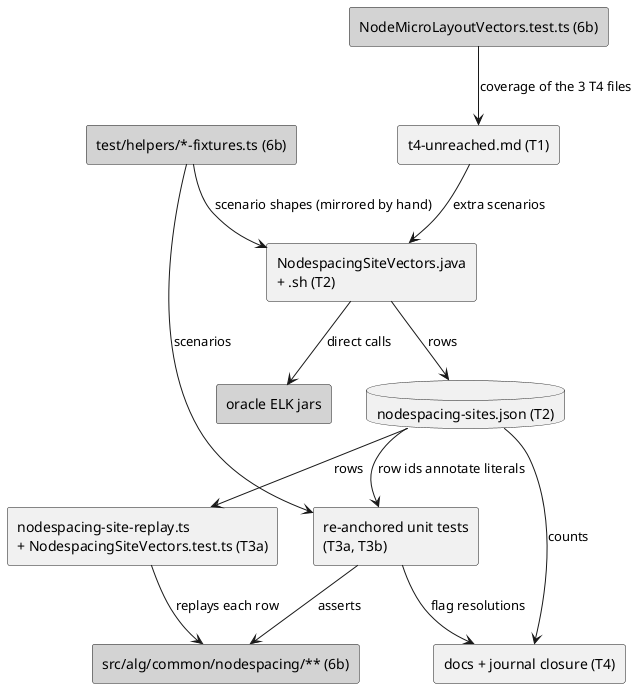

<!-- SPDX-License-Identifier: EPL-2.0 -->

# Component map — mission 6c

What 6c adds (white) and what it reads without changing (grey). Edges carry what flows.

```plantuml
@startuml
skinparam componentStyle rectangle
[t4-unreached.md (T1)] as T1
[NodespacingSiteVectors.java\n+ .sh (T2)] as Rec
database "nodespacing-sites.json (T2)" as Json
[nodespacing-site-replay.ts\n+ NodespacingSiteVectors.test.ts (T3a)] as Rep
[re-anchored unit tests\n(T3a, T3b)] as Unit
[docs + journal closure (T4)] as Docs
[oracle ELK jars] as Elk #lightgray
[src/alg/common/nodespacing/** (6b)] as Port #lightgray
[test/helpers/*-fixtures.ts (6b)] as Fix #lightgray
[NodeMicroLayoutVectors.test.ts (6b)] as Replay #lightgray

Replay --> T1 : coverage of the 3 T4 files
T1 --> Rec : extra scenarios
Fix --> Rec : scenario shapes (mirrored by hand)
Rec --> Elk : direct calls
Rec --> Json : rows
Json --> Rep : rows
Rep --> Port : replays each row
Json --> Unit : row ids annotate literals
Fix --> Unit : scenarios
Unit --> Port : asserts
Json --> Docs : counts
Unit --> Docs : flag resolutions
@enduml
```
