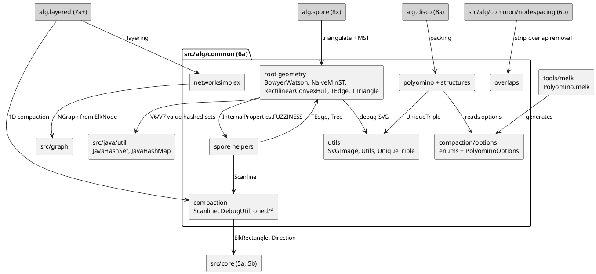

<!-- SPDX-License-Identifier: EPL-2.0 -->

# Component map — mission 6a

What 6a adds under `src/alg/common/`, what it builds on, and its later consumers. Grey components are not part of 6a.

```plantuml
@startuml
skinparam componentStyle rectangle
package "src/alg/common (6a)" {
  [root geometry\nBowyerWatson, NaiveMinST,\nRectilinearConvexHull, TEdge, TTriangle] as Root
  [utils\nSVGImage, Utils, UniqueTriple] as Utils
  [networksimplex] as NS
  [compaction\nScanline, DebugUtil, oned/*] as Comp
  [compaction/options\nenums + PolyominoOptions] as Opts
  [overlaps] as Ovl
  [polyomino + structures] as Poly
  [spore helpers] as Spore
}
[src/alg/common/nodespacing (6b)] as NSp #lightgray
[src/core (5a, 5b)] as Core
[src/graph] as Graph
[src/java/util\nJavaHashSet, JavaHashMap] as JU
[tools/melk\nPolyomino.melk] as Melk
[alg.layered (7a+)] as Layered #lightgray
[alg.disco (8a)] as Disco #lightgray
[alg.spore (8x)] as SporeAlg #lightgray

Root --> Utils : debug SVG
Root --> Spore : InternalProperties.FUZZINESS
Root --> JU : V6/V7 value-hashed sets
Spore --> Root : TEdge, Tree
Spore --> Comp : Scanline
Comp --> Core : ElkRectangle, Direction
Poly --> Opts : reads options
Poly --> Utils : UniqueTriple
Melk --> Opts : generates
NSp --> Ovl : strip overlap removal
Layered --> NS : layering
Layered --> Comp : 1D compaction
Disco --> Poly : packing
SporeAlg --> Root : triangulate + MST
NS --> Graph : NGraph from ElkNode
@enduml
```
