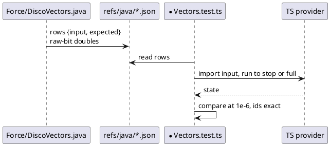
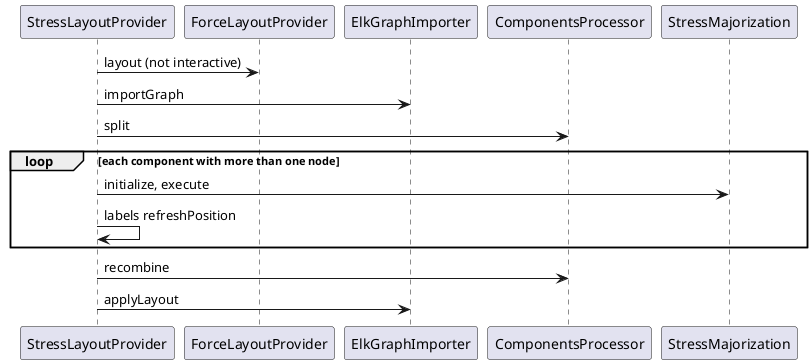
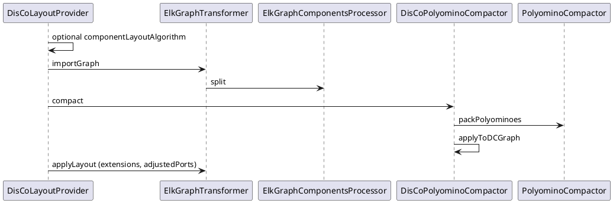

<!-- SPDX-License-Identifier: EPL-2.0 -->

# Data flow — alg-force-disco

## Evidence

```plantuml
@startuml
participant "Force/DiscoVectors.java" as REC
participant "refs/java/*.json" as REF
participant "*Vectors.test.ts" as TV
participant "TS provider" as P
REC -> REF : rows {input, expected}\nraw-bit doubles
TV -> REF : read rows
TV -> P : import input, run to stop or full
P --> TV : state
TV -> TV : compare at 1e-6, ids exact
@enduml
```

## Stress layout (the stop order)

```plantuml
@startuml
participant "StressLayoutProvider" as SLP
participant "ForceLayoutProvider" as FLP
participant "ElkGraphImporter" as IMP
participant "ComponentsProcessor" as CP
participant "StressMajorization" as SM
SLP -> FLP : layout (not interactive)
SLP -> IMP : importGraph
SLP -> CP : split
loop each component with more than one node
  SLP -> SM : initialize, execute
  SLP -> SLP : labels refreshPosition
end
SLP -> CP : recombine
SLP -> IMP : applyLayout
@enduml
```

## Disco layout

```plantuml
@startuml
participant "DisCoLayoutProvider" as DLP
participant "ElkGraphTransformer" as T
participant "ElkGraphComponentsProcessor" as CPR
participant "DisCoPolyominoCompactor" as C
participant "PolyominoCompactor" as PC
DLP -> DLP : optional componentLayoutAlgorithm
DLP -> T : importGraph
T -> CPR : split
DLP -> C : compact
C -> PC : packPolyominoes
C -> C : applyToDCGraph
DLP -> T : applyLayout (extensions, adjustedPorts)
@enduml
```
