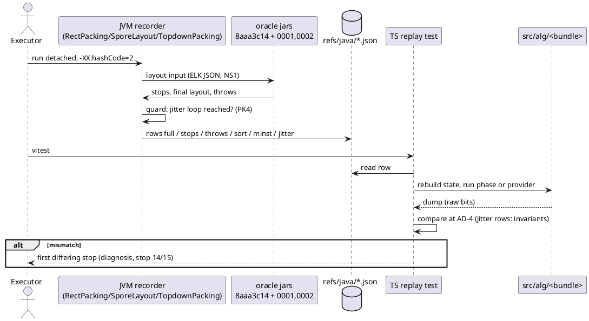

<!-- SPDX-License-Identifier: EPL-2.0 -->

# Data flow — alg-packing evidence (proposed)

How a recorded row proves the port: the oracle records, the TS replays at each stop.

```plantuml
@startuml
actor Executor
participant "JVM recorder\n(RectPacking/SporeLayout/TopdownPacking)" as REC
participant "oracle jars\n8aaa3c14 + 0001,0002" as ORA
database "refs/java/*.json" as REFS
participant "TS replay test" as TS
participant "src/alg/<bundle>" as PORT
Executor -> REC : run detached, -XX:hashCode=2
REC -> ORA : layout input (ELK JSON, NS1)
ORA --> REC : stops, final layout, throws
REC -> REC : guard: jitter loop reached? (PK4)
REC -> REFS : rows full / stops / throws / sort / minst / jitter
Executor -> TS : vitest
TS -> REFS : read row
TS -> PORT : rebuild state, run phase or provider
PORT --> TS : dump (raw bits)
TS -> TS : compare at AD-4 (jitter rows: invariants)
alt mismatch
  TS --> Executor : first differing stop (diagnosis, stop 14/15)
end
@enduml
```
