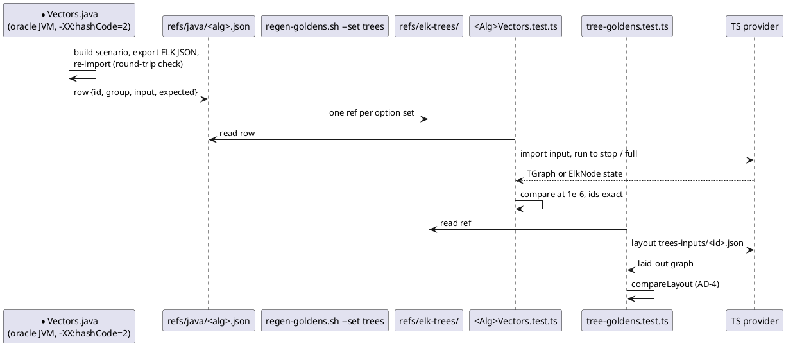
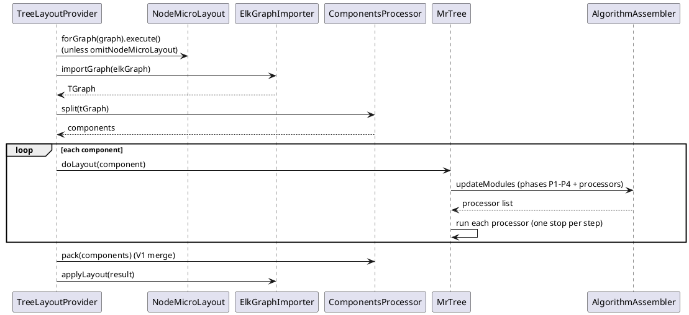

<!-- SPDX-License-Identifier: EPL-2.0 -->

# Data flow — alg-trees

## Evidence: recorded once, replayed by TS (TR1, TR2, TR6)

```plantuml
@startuml
participant "*Vectors.java\n(oracle JVM, -XX:hashCode=2)" as R
participant "refs/java/<alg>.json" as Ref
participant "regen-goldens.sh --set trees" as G
participant "refs/elk-trees/" as GR
participant "<Alg>Vectors.test.ts" as TV
participant "tree-goldens.test.ts" as TG
participant "TS provider" as P
R -> R : build scenario, export ELK JSON,\nre-import (round-trip check)
R -> Ref : row {id, group, input, expected}
G -> GR : one ref per option set
TV -> Ref : read row
TV -> P : import input, run to stop / full
P --> TV : TGraph or ElkNode state
TV -> TV : compare at 1e-6, ids exact
TG -> GR : read ref
TG -> P : layout trees-inputs/<id>.json
P --> TG : laid-out graph
TG -> TG : compareLayout (AD-4)
@enduml
```

## mrtree layout (the shape every stop row follows)

```plantuml
@startuml
participant "TreeLayoutProvider" as TLP
participant "NodeMicroLayout" as NML
participant "ElkGraphImporter" as IMP
participant "ComponentsProcessor" as CP
participant "MrTree" as MT
participant "AlgorithmAssembler" as AA
TLP -> NML : forGraph(graph).execute()\n(unless omitNodeMicroLayout)
TLP -> IMP : importGraph(elkGraph)
IMP --> TLP : TGraph
TLP -> CP : split(tGraph)
CP --> TLP : components
loop each component
  TLP -> MT : doLayout(component)
  MT -> AA : updateModules (phases P1-P4 + processors)
  AA --> MT : processor list
  MT -> MT : run each processor (one stop per step)
end
TLP -> CP : pack(components) (V1 merge)
TLP -> IMP : applyLayout(result)
@enduml
```
