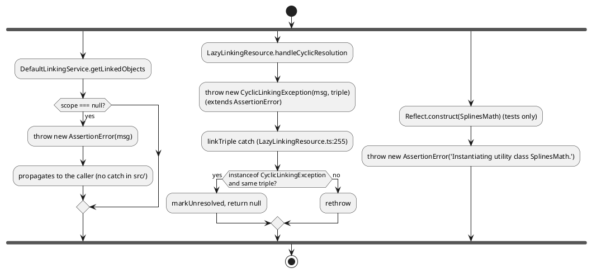

<!-- SPDX-License-Identifier: EPL-2.0 -->

# Data flow: where each AssertionError is thrown and caught

```plantuml
@startuml
start
fork
  :DefaultLinkingService.getLinkedObjects;
  if (scope === null?) then (yes)
    :throw new AssertionError(msg);
    :propagates to the caller (no catch in src/);
  endif
fork again
  :LazyLinkingResource.handleCyclicResolution;
  :throw new CyclicLinkingException(msg, triple)\n(extends AssertionError);
  :linkTriple catch (LazyLinkingResource.ts:255);
  if (instanceof CyclicLinkingException\nand same triple?) then (yes)
    :markUnresolved, return null;
  else (no)
    :rethrow;
  endif
fork again
  :Reflect.construct(SplinesMath) (tests only);
  :throw new AssertionError('Instantiating utility class SplinesMath.');
end fork
stop
@enduml
```
