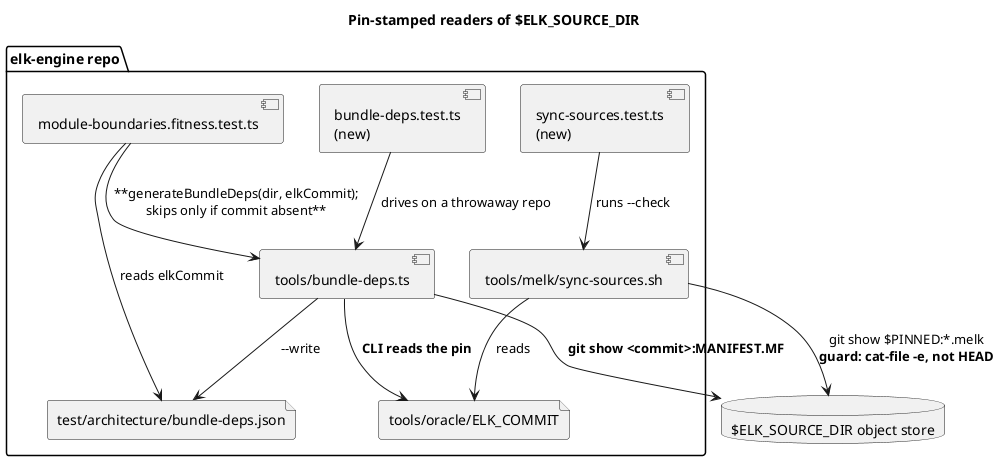

<!-- SPDX-License-Identifier: EPL-2.0 -->

# Component map: bundle-deps-pinned-read

Which pin-stamped tools read the ELK checkout, and how (bold: what the mission changes).

```plantuml
@startuml
title Pin-stamped readers of $ELK_SOURCE_DIR
package "elk-engine repo" {
  file "tools/oracle/ELK_COMMIT" as pin
  [tools/bundle-deps.ts] as deps
  [tools/melk/sync-sources.sh] as sync
  [module-boundaries.fitness.test.ts] as fit
  [bundle-deps.test.ts\n(new)] as unit
  [sync-sources.test.ts\n(new)] as synct
  file "test/architecture/bundle-deps.json" as json
}
database "$ELK_SOURCE_DIR object store" as odb
deps --> pin : **CLI reads the pin**
deps --> odb : **git show <commit>:MANIFEST.MF**
deps --> json : --write
sync --> pin : reads
sync --> odb : git show $PINNED:*.melk\n**guard: cat-file -e, not HEAD**
fit --> json : reads elkCommit
fit --> deps : **generateBundleDeps(dir, elkCommit);\nskips only if commit absent**
unit --> deps : drives on a throwaway repo
synct --> sync : runs --check
@enduml
```
