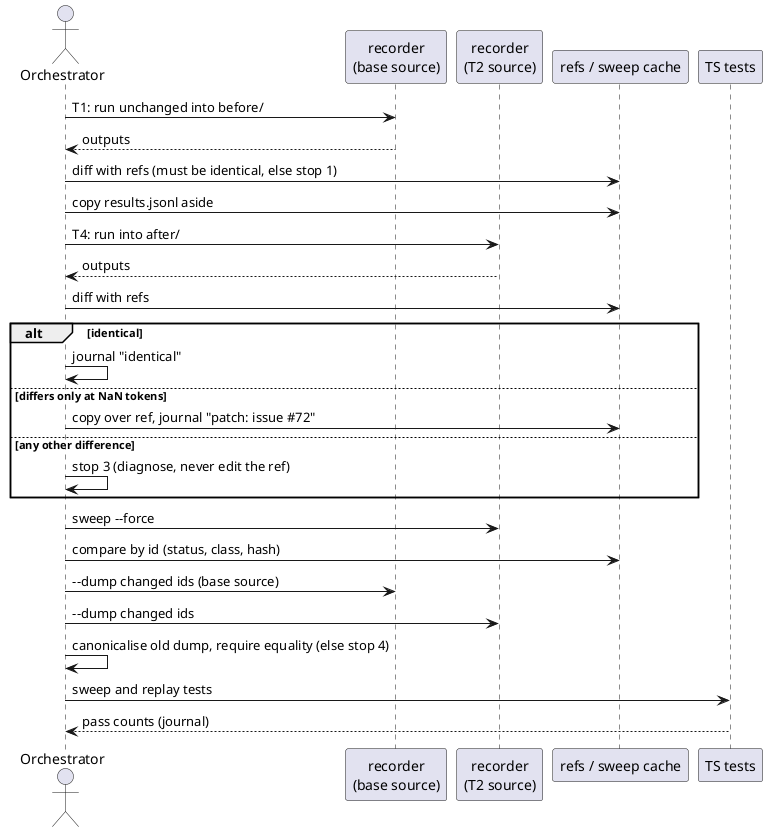

<!-- SPDX-License-Identifier: EPL-2.0 -->

# Data flow: proving a NaN-only change (D7)

```plantuml
@startuml
actor Orchestrator as O
participant "recorder\n(base source)" as RB
participant "recorder\n(T2 source)" as RN
participant "refs / sweep cache" as R
participant "TS tests" as T

O -> RB : T1: run unchanged into before/
RB --> O : outputs
O -> R : diff with refs (must be identical, else stop 1)
O -> R : copy results.jsonl aside
O -> RN : T4: run into after/
RN --> O : outputs
O -> R : diff with refs
alt identical
  O -> O : journal "identical"
else differs only at NaN tokens
  O -> R : copy over ref, journal "patch: issue #72"
else any other difference
  O -> O : stop 3 (diagnose, never edit the ref)
end
O -> RN : sweep --force
O -> R : compare by id (status, class, hash)
O -> RB : --dump changed ids (base source)
O -> RN : --dump changed ids
O -> O : canonicalise old dump, require equality (else stop 4)
O -> T : sweep and replay tests
T --> O : pass counts (journal)
@enduml
```
