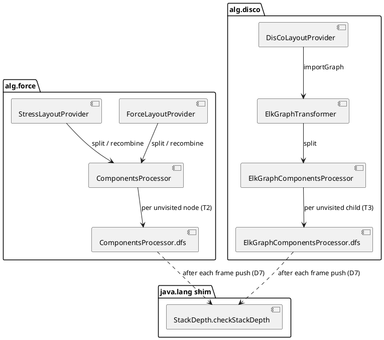

<!-- SPDX-License-Identifier: EPL-2.0 -->

# Component map: who calls the two searches

```plantuml
@startuml
package "alg.force" {
  [ForceLayoutProvider] --> [ComponentsProcessor] : split / recombine
  [StressLayoutProvider] --> [ComponentsProcessor] : split / recombine
  [ComponentsProcessor] --> [ComponentsProcessor.dfs] : per unvisited node (T2)
}
package "alg.disco" {
  [DisCoLayoutProvider] --> [ElkGraphTransformer] : importGraph
  [ElkGraphTransformer] --> [ElkGraphComponentsProcessor] : split
  [ElkGraphComponentsProcessor] --> [ElkGraphComponentsProcessor.dfs] : per unvisited child (T3)
}
package "java.lang shim" {
  [StackDepth.checkStackDepth]
}
[ComponentsProcessor.dfs] ..> [StackDepth.checkStackDepth] : after each frame push (D7)
[ElkGraphComponentsProcessor.dfs] ..> [StackDepth.checkStackDepth] : after each frame push (D7)
@enduml
```

The two bundles do not import each other, so T2 and T3 cannot affect each other's tests.
