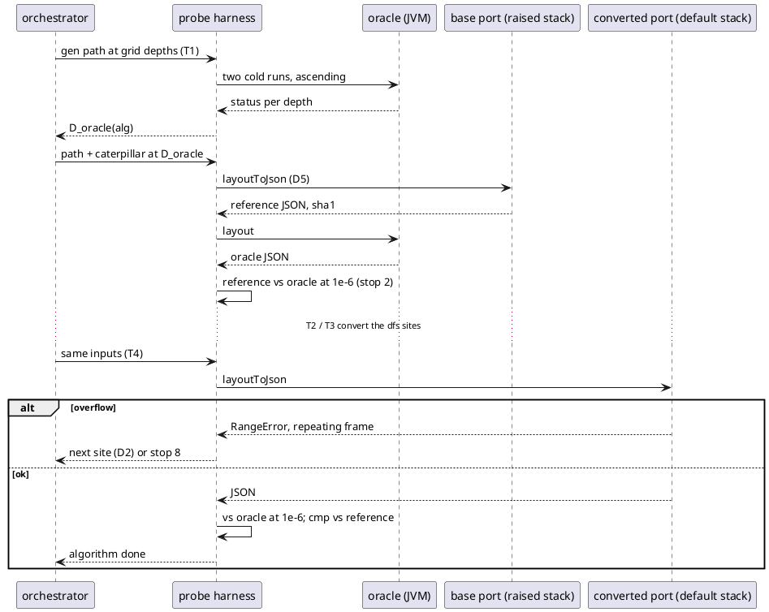

<!-- SPDX-License-Identifier: EPL-2.0 -->

# Data flow: the evidence of one algorithm

```plantuml
@startuml
participant "orchestrator" as Or
participant "probe harness" as H
participant "oracle (JVM)" as O
participant "base port (raised stack)" as B
participant "converted port (default stack)" as C
Or -> H : gen path at grid depths (T1)
H -> O : two cold runs, ascending
O --> H : status per depth
H --> Or : D_oracle(alg)
Or -> H : path + caterpillar at D_oracle
H -> B : layoutToJson (D5)
B --> H : reference JSON, sha1
H -> O : layout
O --> H : oracle JSON
H -> H : reference vs oracle at 1e-6 (stop 2)
... T2 / T3 convert the dfs sites ...
Or -> H : same inputs (T4)
H -> C : layoutToJson
alt overflow
  C --> H : RangeError, repeating frame
  H --> Or : next site (D2) or stop 8
else ok
  C --> H : JSON
  H -> H : vs oracle at 1e-6; cmp vs reference
  H --> Or : algorithm done
end
@enduml
```
