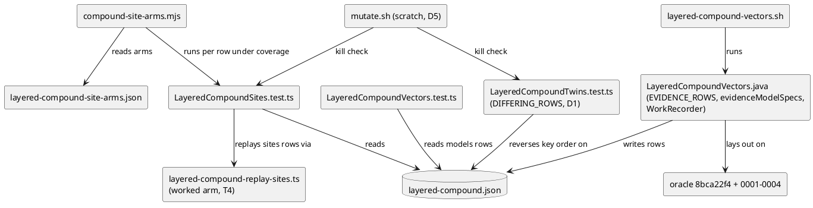

<!-- SPDX-License-Identifier: EPL-2.0 -->

# compound-mutant-rows: component map

What each task touches and what checks it. Proposed state.

```plantuml
@startuml
skinparam componentStyle rectangle
component "LayeredCompoundVectors.java\n(EVIDENCE_ROWS, evidenceModelSpecs,\nWorkRecorder)" as REC
component "layered-compound-vectors.sh" as SH
database "layered-compound.json" as REF
component "oracle 8bca22f4 + 0001-0004" as ORA
component "LayeredCompoundSites.test.ts" as SITES
component "LayeredCompoundVectors.test.ts" as VEC
component "LayeredCompoundTwins.test.ts\n(DIFFERING_ROWS, D1)" as TWINS
component "layered-compound-replay-sites.ts\n(worked arm, T4)" as REPLAY
component "layered-compound-site-arms.json" as ARMS
component "compound-site-arms.mjs" as ARMTOOL
component "mutate.sh (scratch, D5)" as MUT

SH --> REC : runs
REC --> ORA : lays out on
REC --> REF : writes rows
SITES --> REPLAY : replays sites rows via
SITES --> REF : reads
VEC --> REF : reads models rows
TWINS --> REF : reverses key order on
ARMTOOL --> ARMS : reads arms
ARMTOOL --> SITES : runs per row under coverage
MUT --> SITES : kill check
MUT --> TWINS : kill check
@enduml
```
