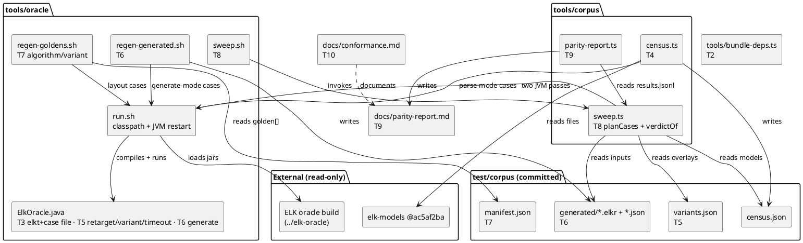

<!-- SPDX-License-Identifier: EPL-2.0 -->

# Component map — conformance-corpus

What this mission touches (proposed state). Task ids mark which task creates or changes each
component.

```plantuml
@startuml
skinparam componentStyle rectangle

package "External (read-only)" {
  [elk-models @ac5af2ba] as models
  [ELK oracle build\n(../elk-oracle)] as build
}

package "tools/oracle" {
  [ElkOracle.java\nT3 elkt+case file · T5 retarget/variant/timeout · T6 generate] as harness
  [run.sh\nclasspath + JVM restart] as run
  [regen-goldens.sh\nT7 algorithm/variant] as regen
  [regen-generated.sh\nT6] as regengen
  [sweep.sh\nT8] as sweepsh
}

package "tools/corpus" {
  [census.ts\nT4] as census
  [sweep.ts\nT8 planCases + verdictOf] as sweep
  [parity-report.ts\nT9] as report
}

package "test/corpus (committed)" {
  [census.json] as censusjson
  [variants.json\nT5] as variants
  [generated/*.elkr + *.json\nT6] as generated
  [manifest.json\nT7] as manifest
}

[docs/parity-report.md\nT9] as reportmd
[docs/conformance.md\nT10] as confdoc
[tools/bundle-deps.ts\nT2] as deps

run --> build : loads jars
run --> harness : compiles + runs
census --> run : parse-mode cases
census --> models : reads files
census --> censusjson : writes
regengen --> run : generate-mode cases
regengen --> generated : writes
regen --> run : layout cases
regen --> manifest : reads golden[]
sweepsh --> sweep : invokes
sweep --> censusjson : reads models
sweep --> variants : reads overlays
sweep --> generated : reads inputs
sweep --> run : two JVM passes
report --> sweep : reads results.jsonl
report --> reportmd : writes
confdoc ..> reportmd : documents
@enduml
```
