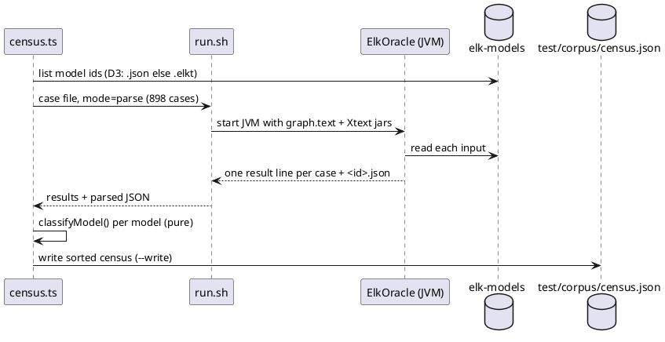
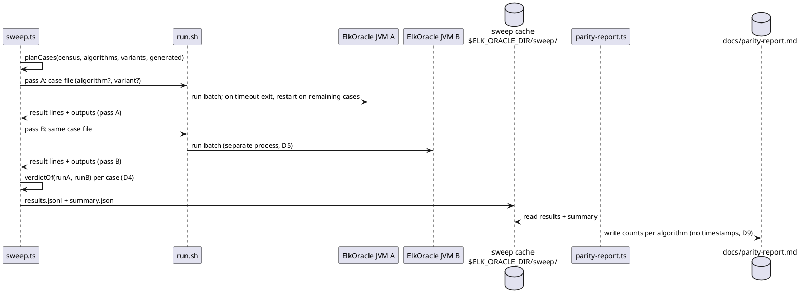
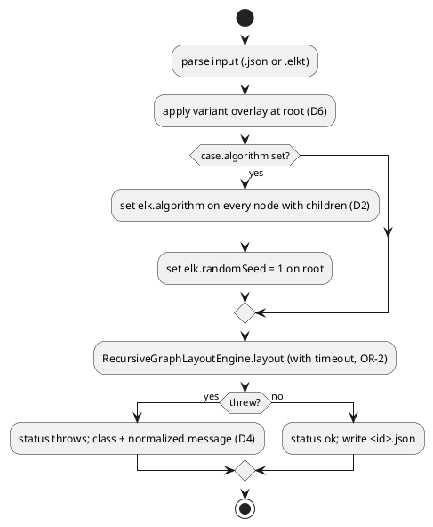

<!-- SPDX-License-Identifier: EPL-2.0 -->

# Data flow — conformance-corpus

## Census (T4)

```plantuml
@startuml
participant "census.ts" as C
participant "run.sh" as R
participant "ElkOracle (JVM)" as O
database "elk-models" as M
database "test/corpus/census.json" as J

C -> M : list model ids (D3: .json else .elkt)
C -> R : case file, mode=parse (898 cases)
R -> O : start JVM with graph.text + Xtext jars
O -> M : read each input
O --> R : one result line per case + <id>.json
R --> C : results + parsed JSON
C -> C : classifyModel() per model (pure)
C -> J : write sorted census (--write)
@enduml
```

## Sweep and report (T8, T9)

```plantuml
@startuml
participant "sweep.ts" as S
participant "run.sh" as R
participant "ElkOracle JVM A" as A
participant "ElkOracle JVM B" as B
database "sweep cache\n$ELK_ORACLE_DIR/sweep/" as K
participant "parity-report.ts" as P
database "docs/parity-report.md" as D

S -> S : planCases(census, algorithms, variants, generated)
S -> R : pass A: case file (algorithm?, variant?)
R -> A : run batch; on timeout exit, restart on remaining cases
A --> S : result lines + outputs (pass A)
S -> R : pass B: same case file
R -> B : run batch (separate process, D5)
B --> S : result lines + outputs (pass B)
S -> S : verdictOf(runA, runB) per case (D4)
S -> K : results.jsonl + summary.json
P -> K : read results + summary
P -> D : write counts per algorithm (no timestamps, D9)
@enduml
```

## Retarget inside one case (T5)

```plantuml
@startuml
start
:parse input (.json or .elkt);
:apply variant overlay at root (D6);
if (case.algorithm set?) then (yes)
  :set elk.algorithm on every node with children (D2);
  :set elk.randomSeed = 1 on root;
endif
:RecursiveGraphLayoutEngine.layout (with timeout, OR-2);
if (threw?) then (yes)
  :status throws; class + normalized message (D4);
else (no)
  :status ok; write <id>.json;
endif
stop
@enduml
```
