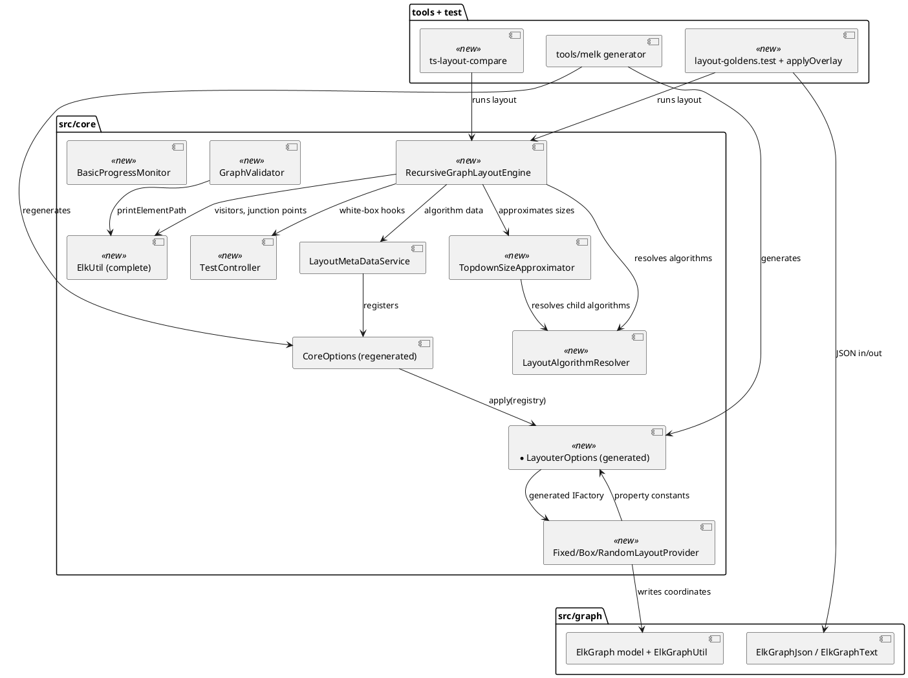

<!-- SPDX-License-Identifier: EPL-2.0 -->

# Component map — core-engine

New components are marked `<<new>>`; the rest exist on `main`.

```plantuml
@startuml
package "src/core" {
  [RecursiveGraphLayoutEngine] <<new>> as engine
  [LayoutAlgorithmResolver] <<new>> as resolver
  [GraphValidator] <<new>> as validator
  [TopdownSizeApproximator] <<new>> as topdown
  [TestController] <<new>> as testctl
  [BasicProgressMonitor] <<new>> as monitor
  [ElkUtil (complete)] <<new>> as elkutil
  [Fixed/Box/RandomLayoutProvider] <<new>> as providers
  [*LayouterOptions (generated)] <<new>> as options
  [LayoutMetaDataService] as lmds
  [CoreOptions (regenerated)] as core
}
package "src/graph" {
  [ElkGraph model + ElkGraphUtil] as graph
  [ElkGraphJson / ElkGraphText] as io
}
package "tools + test" {
  [tools/melk generator] as melk
  [layout-goldens.test + applyOverlay] <<new>> as goldens
  [ts-layout-compare] <<new>> as compare
}
engine --> resolver : resolves algorithms
engine --> topdown : approximates sizes
engine --> testctl : white-box hooks
engine --> lmds : algorithm data
engine --> elkutil : visitors, junction points
validator --> elkutil : printElementPath
topdown --> resolver : resolves child algorithms
providers --> options : property constants
options --> providers : generated IFactory
core --> options : apply(registry)
lmds --> core : registers
melk --> options : generates
melk --> core : regenerates
goldens --> engine : runs layout
goldens --> io : JSON in/out
compare --> engine : runs layout
providers --> graph : writes coordinates
@enduml
```
