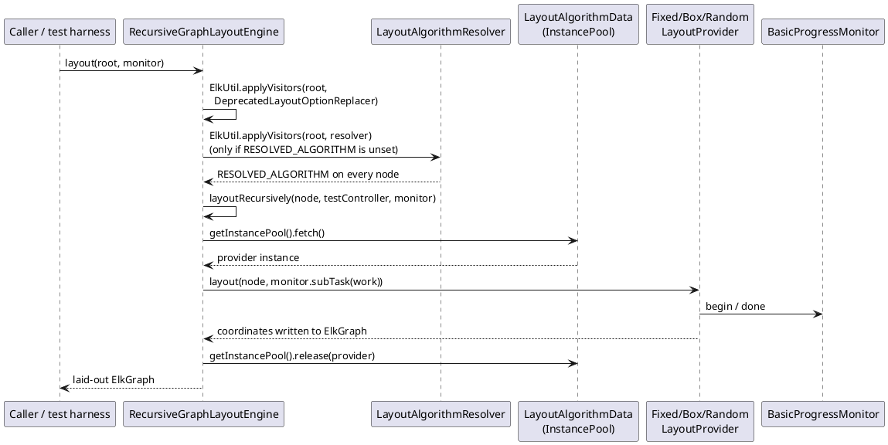
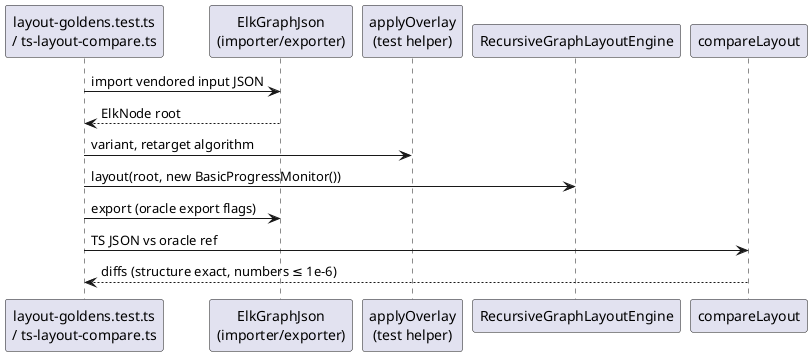

<!-- SPDX-License-Identifier: EPL-2.0 -->

# Data flow — core-engine

## Layout of one hierarchy level (RecursiveGraphLayoutEngine)

```plantuml
@startuml
participant "Caller / test harness" as caller
participant RecursiveGraphLayoutEngine as engine
participant LayoutAlgorithmResolver as resolver
participant "LayoutAlgorithmData\n(InstancePool)" as data
participant "Fixed/Box/Random\nLayoutProvider" as provider
participant BasicProgressMonitor as monitor
caller -> engine : layout(root, monitor)
engine -> engine : ElkUtil.applyVisitors(root,\n  DeprecatedLayoutOptionReplacer)
engine -> resolver : ElkUtil.applyVisitors(root, resolver)\n(only if RESOLVED_ALGORITHM is unset)
resolver --> engine : RESOLVED_ALGORITHM on every node
engine -> engine : layoutRecursively(node, testController, monitor)
engine -> data : getInstancePool().fetch()
data --> engine : provider instance
engine -> provider : layout(node, monitor.subTask(work))
provider -> monitor : begin / done
provider --> engine : coordinates written to ElkGraph
engine -> data : getInstancePool().release(provider)
engine --> caller : laid-out ElkGraph
@enduml
```

## Golden check (T17) and corpus comparison (T19)

```plantuml
@startuml
participant "layout-goldens.test.ts\n/ ts-layout-compare.ts" as test
participant "ElkGraphJson\n(importer/exporter)" as json
participant "applyOverlay\n(test helper)" as overlay
participant RecursiveGraphLayoutEngine as engine
participant compareLayout as cmp
test -> json : import vendored input JSON
json --> test : ElkNode root
test -> overlay : variant, retarget algorithm
test -> engine : layout(root, new BasicProgressMonitor())
test -> json : export (oracle export flags)
test -> cmp : TS JSON vs oracle ref
cmp --> test : diffs (structure exact, numbers ≤ 1e-6)
@enduml
```
