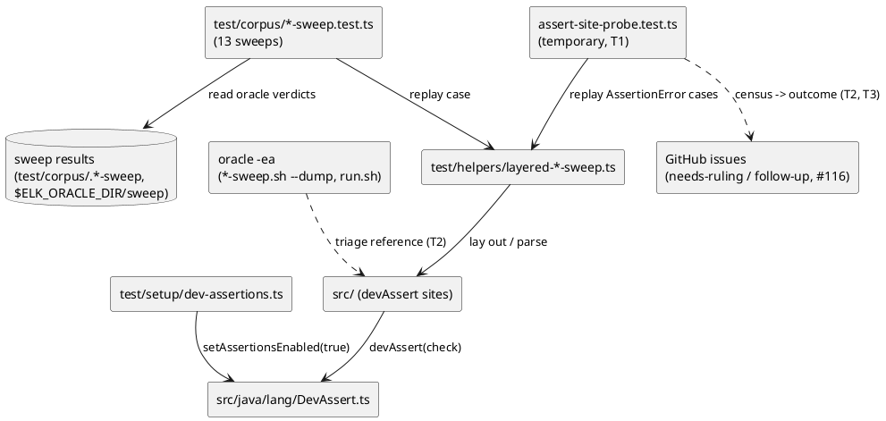

<!-- SPDX-License-Identifier: EPL-2.0 -->

# Component map: corpus-sweeps-asserts

```plantuml
@startuml
skinparam componentStyle rectangle
component "test/setup/dev-assertions.ts" as setup
component "test/corpus/*-sweep.test.ts\n(13 sweeps)" as sweeps
component "test/helpers/layered-*-sweep.ts" as helpers
component "src/ (devAssert sites)" as src
component "src/java/lang/DevAssert.ts" as dev
component "assert-site-probe.test.ts\n(temporary, T1)" as probe
database "sweep results\n(test/corpus/.*-sweep,\n$ELK_ORACLE_DIR/sweep)" as data
component "oracle -ea\n(*-sweep.sh --dump, run.sh)" as oracle
component "GitHub issues\n(needs-ruling / follow-up, #116)" as gh

setup --> dev : setAssertionsEnabled(true)
sweeps --> helpers : replay case
helpers --> src : lay out / parse
src --> dev : devAssert(check)
sweeps --> data : read oracle verdicts
probe --> helpers : replay AssertionError cases
oracle ..> src : triage reference (T2)
probe ..> gh : census -> outcome (T2, T3)
@enduml
```
