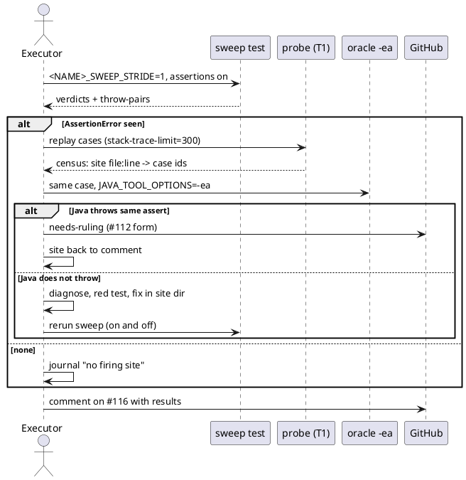

<!-- SPDX-License-Identifier: EPL-2.0 -->

# Data flow: one firing assert, from sweep to outcome

```plantuml
@startuml
actor Executor
participant "sweep test" as S
participant "probe (T1)" as P
participant "oracle -ea" as O
participant "GitHub" as G

Executor -> S : <NAME>_SWEEP_STRIDE=1, assertions on
S --> Executor : verdicts + throw-pairs
alt AssertionError seen
  Executor -> P : replay cases (stack-trace-limit=300)
  P --> Executor : census: site file:line -> case ids
  Executor -> O : same case, JAVA_TOOL_OPTIONS=-ea
  alt Java throws same assert
    Executor -> G : needs-ruling (#112 form)
    Executor -> Executor : site back to comment
  else Java does not throw
    Executor -> Executor : diagnose, red test, fix in site dir
    Executor -> S : rerun sweep (on and off)
  end
else none
  Executor -> Executor : journal "no firing site"
end
Executor -> G : comment on #116 with results
@enduml
```
