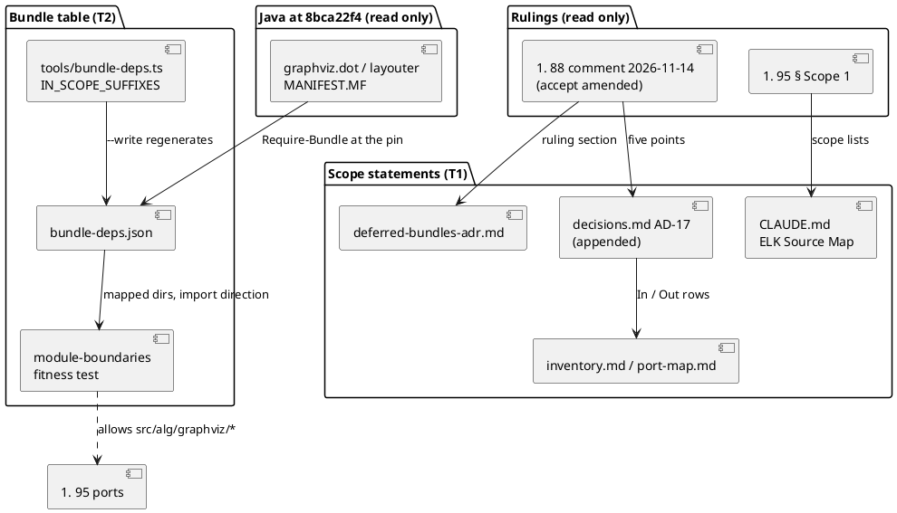

<!-- SPDX-License-Identifier: EPL-2.0 -->

# Component map: where bundle scope is stated, and what this mission writes

```plantuml
@startuml
package "Rulings (read only)" {
  [#88 comment 2026-11-14\n(accept amended)] as R
  [#95 § Scope 1] as S
}
package "Java at 8bca22f4 (read only)" {
  [graphviz.dot / layouter\nMANIFEST.MF] as M
}
package "Scope statements (T1)" {
  [deferred-bundles-adr.md] as ADR
  [decisions.md AD-17\n(appended)] as AD
  [CLAUDE.md\nELK Source Map] as C
  [inventory.md / port-map.md] as I
}
package "Bundle table (T2)" {
  [tools/bundle-deps.ts\nIN_SCOPE_SUFFIXES] as T
  [bundle-deps.json] as J
  [module-boundaries\nfitness test] as F
}
R --> ADR : ruling section
R --> AD : five points
S --> C : scope lists
AD --> I : In / Out rows
T --> J : --write regenerates
M --> J : Require-Bundle at the pin
J --> F : mapped dirs, import direction
F ..> [#95 ports] : allows src/alg/graphviz/*
@enduml
```
