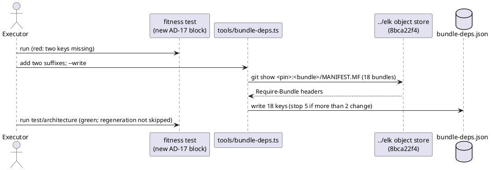

<!-- SPDX-License-Identifier: EPL-2.0 -->

# Data flow: T2's red-green regeneration

```plantuml
@startuml
actor Executor
participant "fitness test\n(new AD-17 block)" as F
participant "tools/bundle-deps.ts" as T
participant "../elk object store\n(8bca22f4)" as E
database "bundle-deps.json" as J

Executor -> F : run (red: two keys missing)
Executor -> T : add two suffixes; --write
T -> E : git show <pin>:<bundle>/MANIFEST.MF (18 bundles)
E --> T : Require-Bundle headers
T -> J : write 18 keys (stop 5 if more than 2 change)
Executor -> F : run test/architecture (green; regeneration not skipped)
@enduml
```
