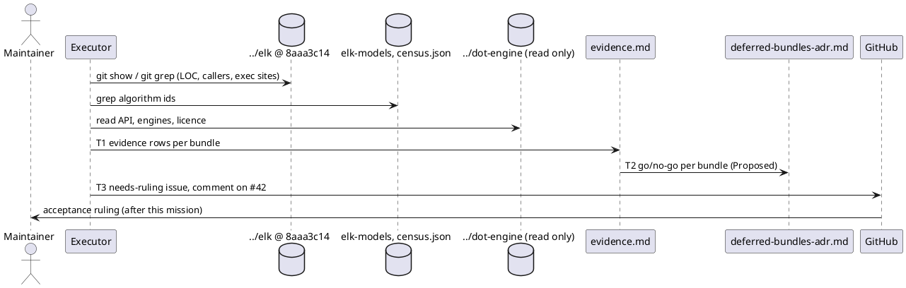

<!-- SPDX-License-Identifier: EPL-2.0 -->

# Data flow: deferred-bundles-adr

How the mission turns pinned source into a Proposed ADR and a ruling request.

```plantuml
@startuml
actor Maintainer
participant "Executor" as EX
database "../elk @ 8aaa3c14" as ELK
database "elk-models, census.json" as CORPUS
database "../dot-engine (read only)" as DE
participant "evidence.md" as EV
participant "deferred-bundles-adr.md" as ADR
participant "GitHub" as GH

EX -> ELK : git show / git grep (LOC, callers, exec sites)
EX -> CORPUS : grep algorithm ids
EX -> DE : read API, engines, licence
EX -> EV : T1 evidence rows per bundle
EV -> ADR : T2 go/no-go per bundle (Proposed)
EX -> GH : T3 needs-ruling issue, comment on #42
GH -> Maintainer : acceptance ruling (after this mission)
@enduml
```
