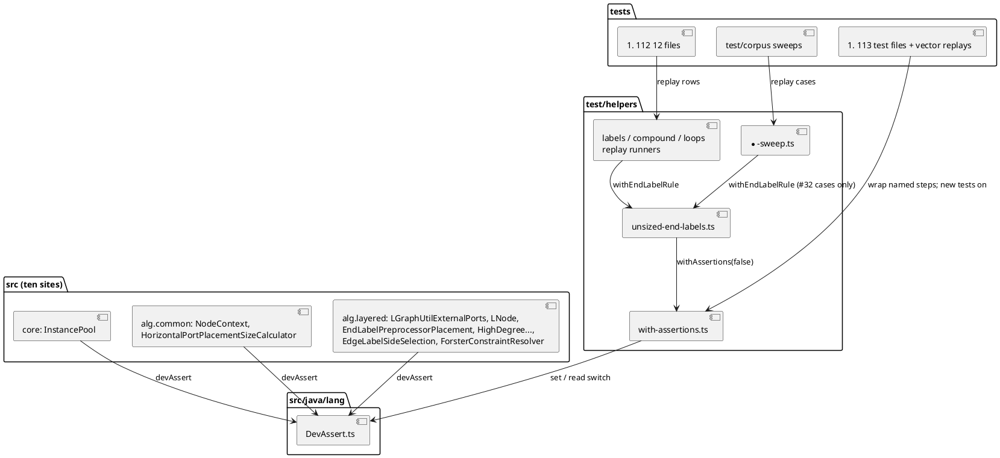

<!-- SPDX-License-Identifier: EPL-2.0 -->

# Component map: dev-assert-restore

```plantuml
@startuml
package "src/java/lang" {
  [DevAssert.ts] as DA
}
package "src (ten sites)" {
  [core: InstancePool] as S9
  [alg.common: NodeContext,\nHorizontalPortPlacementSizeCalculator] as SC
  [alg.layered: LGraphUtilExternalPorts, LNode,\nEndLabelPreprocessorPlacement, HighDegree...,\nEdgeLabelSideSelection, ForsterConstraintResolver] as SL
}
package "test/helpers" {
  [with-assertions.ts] as WA
  [unsized-end-labels.ts] as UE
  [labels / compound / loops\nreplay runners] as RR
  [*-sweep.ts] as SW
}
package "tests" {
  [#113 test files + vector replays] as TT
  [#112 12 files] as T32
  [test/corpus sweeps] as CS
}
S9 --> DA : devAssert
SC --> DA : devAssert
SL --> DA : devAssert
WA --> DA : set / read switch
UE --> WA : withAssertions(false)
RR --> UE : withEndLabelRule
SW --> UE : withEndLabelRule (#32 cases only)
T32 --> RR : replay rows
TT --> WA : wrap named steps; new tests on
CS --> SW : replay cases
@enduml
```
