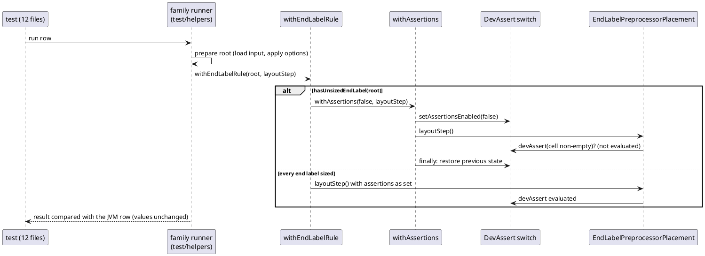
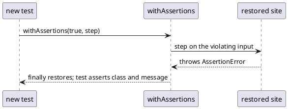

<!-- SPDX-License-Identifier: EPL-2.0 -->

# Data flow: a replayed row with an unsized end label (#32)

```plantuml
@startuml
participant "test (12 files)" as T
participant "family runner\n(test/helpers)" as R
participant "withEndLabelRule" as W
participant "withAssertions" as A
participant "DevAssert switch" as S
participant "EndLabelPreprocessorPlacement" as P

T -> R : run row
R -> R : prepare root (load input, apply options)
R -> W : withEndLabelRule(root, layoutStep)
alt hasUnsizedEndLabel(root)
  W -> A : withAssertions(false, layoutStep)
  A -> S : setAssertionsEnabled(false)
  A -> P : layoutStep()
  P -> S : devAssert(cell non-empty)? (not evaluated)
  A -> S : finally: restore previous state
else every end label sized
  W -> P : layoutStep() with assertions as set
  P -> S : devAssert evaluated
end
R --> T : result compared with the JVM row (values unchanged)
@enduml
```

# Data flow: a new site test

```plantuml
@startuml
participant "new test" as N
participant "withAssertions" as A
participant "restored site" as X
N -> A : withAssertions(true, step)
A -> X : step on the violating input
X --> A : throws AssertionError
A --> N : finally restores; test asserts class and message
@enduml
```
