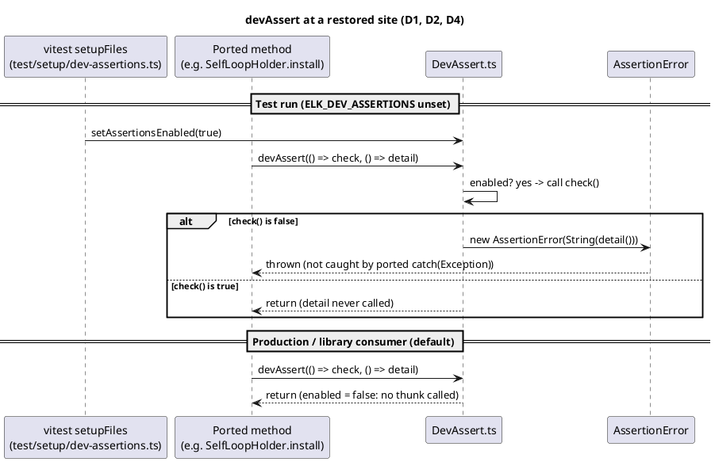

<!-- SPDX-License-Identifier: EPL-2.0 -->

# Data flow: a restored `assert` site

```plantuml
@startuml
title devAssert at a restored site (D1, D2, D4)
participant "vitest setupFiles\n(test/setup/dev-assertions.ts)" as Setup
participant "Ported method\n(e.g. SelfLoopHolder.install)" as Site
participant "DevAssert.ts" as DA
participant "AssertionError" as AE

== Test run (ELK_DEV_ASSERTIONS unset) ==
Setup -> DA : setAssertionsEnabled(true)
Site -> DA : devAssert(() => check, () => detail)
DA -> DA : enabled? yes -> call check()
alt check() is false
  DA -> AE : new AssertionError(String(detail()))
  AE --> Site : thrown (not caught by ported catch(Exception))
else check() is true
  DA --> Site : return (detail never called)
end

== Production / library consumer (default) ==
Site -> DA : devAssert(() => check, () => detail)
DA --> Site : return (enabled = false: no thunk called)
@enduml
```
