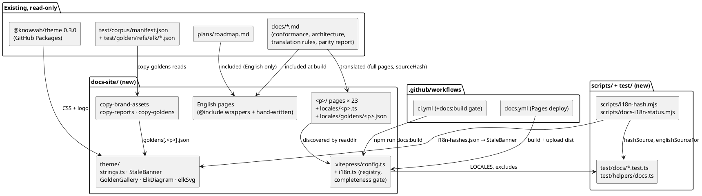

<!-- SPDX-License-Identifier: EPL-2.0 -->

# Component map — docs-site

Which parts the mission creates (new) and reads (existing, unchanged).

```plantuml
@startuml
skinparam componentStyle rectangle

package "Existing, read-only" {
  component "docs/*.md\n(conformance, architecture,\ntranslation rules, parity report)" as docs
  component "test/corpus/manifest.json\n+ test/golden/refs/elk/*.json" as goldens
  component "plans/roadmap.md" as roadmap
  component "@knowvah/theme 0.3.0\n(GitHub Packages)" as theme
}

package "docs-site/ (new)" {
  component "English pages\n(@include wrappers + hand-written)" as en
  component "<p>/ pages × 23\n+ locales/<p>.ts\n+ locales/goldens/<p>.json" as locales
  component ".vitepress/config.ts\n+ i18n.ts (registry,\ncompleteness gate)" as config
  component "theme/\nstrings.ts · StaleBanner\nGoldenGallery · ElkDiagram · elkSvg" as themedir
  component "copy-brand-assets\ncopy-reports · copy-goldens" as copy
}

package "scripts/ + test/ (new)" {
  component "scripts/i18n-hash.mjs\nscripts/docs-i18n-status.mjs" as drift
  component "test/docs/*.test.ts\ntest/helpers/docs.ts" as tests
}

package ".github/workflows" {
  component "ci.yml (+docs:build gate)" as ci
  component "docs.yml (Pages deploy)" as deploy
}

docs --> en : included at build
docs --> locales : translated (full pages, sourceHash)
roadmap --> en : included (English-only)
goldens --> copy : copy-goldens reads
copy --> themedir : goldens[.<p>].json
theme --> themedir : CSS + logo
locales --> config : discovered by readdir
config --> tests : LOCALES, excludes
drift --> themedir : i18n-hashes.json → StaleBanner
drift --> tests : hashSource, englishSourceFor
ci --> config : npm run docs:build
deploy --> config : build + upload dist
@enduml
```
