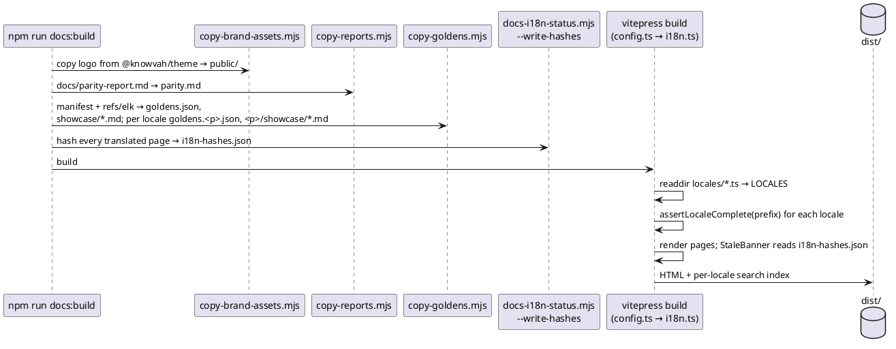
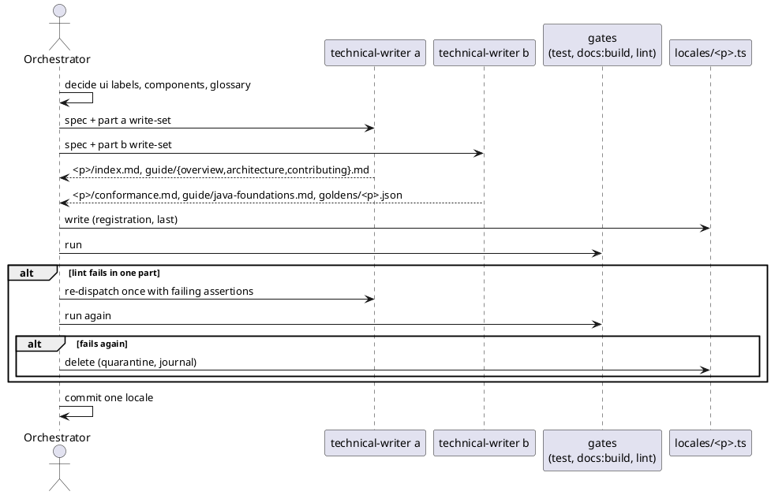
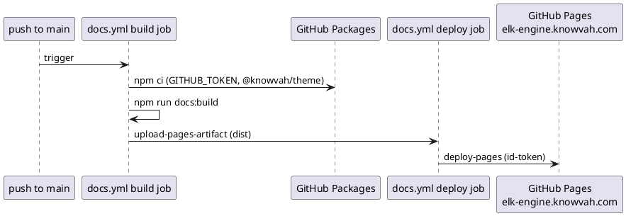

<!-- SPDX-License-Identifier: EPL-2.0 -->

# Data flow — docs-site

## `npm run docs:build`

```plantuml
@startuml
participant "npm run docs:build" as npm
participant "copy-brand-assets.mjs" as brand
participant "copy-reports.mjs" as reports
participant "copy-goldens.mjs" as goldens
participant "docs-i18n-status.mjs\n--write-hashes" as status
participant "vitepress build\n(config.ts → i18n.ts)" as vp
database "dist/" as dist

npm -> brand : copy logo from @knowvah/theme → public/
npm -> reports : docs/parity-report.md → parity.md
npm -> goldens : manifest + refs/elk → goldens.json,\nshowcase/*.md; per locale goldens.<p>.json, <p>/showcase/*.md
npm -> status : hash every translated page → i18n-hashes.json
npm -> vp : build
vp -> vp : readdir locales/*.ts → LOCALES
vp -> vp : assertLocaleComplete(prefix) for each locale
vp -> vp : render pages; StaleBanner reads i18n-hashes.json
vp -> dist : HTML + per-locale search index
@enduml
```

## Translating one locale (batches 6–11)

```plantuml
@startuml
actor Orchestrator as orch
participant "technical-writer a" as a
participant "technical-writer b" as b
participant "gates\n(test, docs:build, lint)" as gates
participant "locales/<p>.ts" as mod

orch -> orch : decide ui labels, components, glossary
orch -> a : spec + part a write-set
orch -> b : spec + part b write-set
a --> orch : <p>/index.md, guide/{overview,architecture,contributing}.md
b --> orch : <p>/conformance.md, guide/java-foundations.md, goldens/<p>.json
orch -> mod : write (registration, last)
orch -> gates : run
alt lint fails in one part
  orch -> a : re-dispatch once with failing assertions
  orch -> gates : run again
  alt fails again
    orch -> mod : delete (quarantine, journal)
  end
end
orch -> orch : commit one locale
@enduml
```

## Deploy

```plantuml
@startuml
participant "push to main" as push
participant "docs.yml build job" as build
participant "GitHub Packages" as pkgs
participant "docs.yml deploy job" as deploy
participant "GitHub Pages\nelk-engine.knowvah.com" as pages

push -> build : trigger
build -> pkgs : npm ci (GITHUB_TOKEN, @knowvah/theme)
build -> build : npm run docs:build
build -> deploy : upload-pages-artifact (dist)
deploy -> pages : deploy-pages (id-token)
@enduml
```
