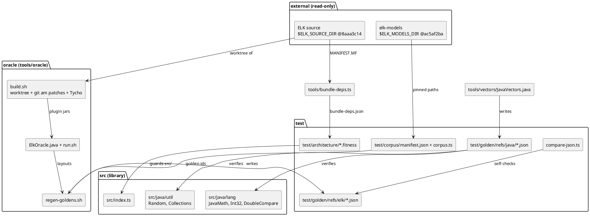

<!-- SPDX-License-Identifier: EPL-2.0 -->

# Component map — what this mission builds

Everything is new. External inputs are read-only.

```plantuml
@startuml
skinparam componentStyle rectangle
package "external (read-only)" {
  [ELK source\n$ELK_SOURCE_DIR @8aaa3c14] as elk
  [elk-models\n$ELK_MODELS_DIR @ac5af2ba] as models
}
package "oracle (tools/oracle)" {
  [build.sh\nworktree + git am patches + Tycho] as build
  [ElkOracle.java + run.sh] as harness
  [regen-goldens.sh] as regen
}
[tools/vectors/JavaVectors.java] as vectors
[tools/bundle-deps.ts] as bdeps
package "src (library)" {
  [src/java/util\nRandom, Collections] as jutil
  [src/java/lang\nJavaMath, Int32, DoubleCompare] as jlang
  [src/index.ts] as index
}
package "test" {
  [test/golden/refs/java/*.json] as jrefs
  [test/golden/refs/elk/*.json] as erefs
  [compare-json.ts] as cmp
  [test/corpus/manifest.json + corpus.ts] as corpus
  [test/architecture/*.fitness] as fit
}
elk --> build : worktree of
build --> harness : plugin jars
models --> corpus : pinned paths
corpus --> regen : golden ids
harness --> regen : layouts
regen --> erefs : writes
vectors --> jrefs : writes
jrefs --> jutil : verifies
jrefs --> jlang : verifies
cmp --> erefs : self-checks
elk --> bdeps : MANIFEST.MF
bdeps --> fit : bundle-deps.json
fit --> index : guards src/
@enduml
```
