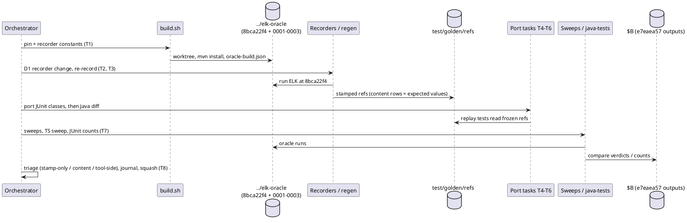

<!-- SPDX-License-Identifier: EPL-2.0 -->

# Data flow: the pin move

```plantuml
@startuml
participant "Orchestrator" as O
participant "build.sh" as B
database "../elk-oracle\n(8bca22f4 + 0001-0003)" as OR
participant "Recorders / regen" as R
database "test/golden/refs" as REFS
participant "Port tasks T4-T6" as P
participant "Sweeps / java-tests" as S
database "$B (e7eaea57 outputs)" as BEFORE

O -> B : pin + recorder constants (T1)
B -> OR : worktree, mvn install, oracle-build.json
O -> R : D1 recorder change, re-record (T2, T3)
R -> OR : run ELK at 8bca22f4
R -> REFS : stamped refs (content rows = expected values)
O -> P : port JUnit classes, then Java diff
P -> REFS : replay tests read frozen refs
O -> S : sweeps, TS sweep, JUnit counts (T7)
S -> OR : oracle runs
S -> BEFORE : compare verdicts / counts
O -> O : triage (stamp-only / content / tool-side), journal, squash (T8)
@enduml
```
