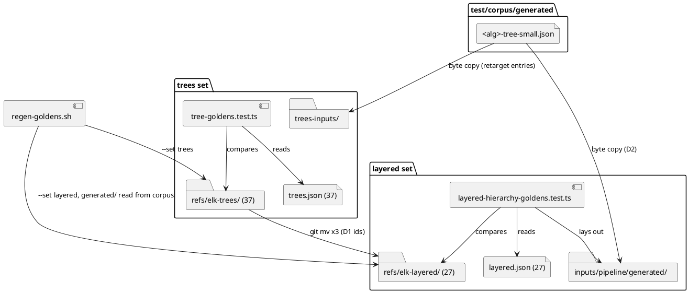

<!-- SPDX-License-Identifier: EPL-2.0 -->

# Component map: the two golden sets after the move

```plantuml
@startuml
package "test/corpus/generated" as CG {
  file "<alg>-tree-small.json" as SRC
}
package "trees set" {
  file "trees.json (37)" as TM
  folder "trees-inputs/" as TI
  folder "refs/elk-trees/ (37)" as TR
  component "tree-goldens.test.ts" as TT
}
package "layered set" {
  file "layered.json (27)" as LM
  folder "inputs/pipeline/generated/" as LI
  folder "refs/elk-layered/ (27)" as LR
  component "layered-hierarchy-goldens.test.ts" as LT
}
component "regen-goldens.sh" as RG

SRC --> TI : byte copy (retarget entries)
SRC --> LI : byte copy (D2)
RG --> LR : --set layered, generated/ read from corpus
RG --> TR : --set trees
TT --> TM : reads
TT --> TR : compares
LT --> LM : reads
LT --> LI : lays out
LT --> LR : compares
TR --> LR : git mv x3 (D1 ids)
@enduml
```
