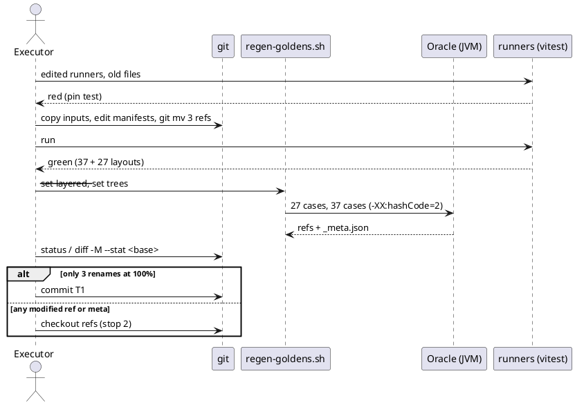

<!-- SPDX-License-Identifier: EPL-2.0 -->

# Data flow: move and proof (T1)

```plantuml
@startuml
actor Executor
participant "git" as G
participant "regen-goldens.sh" as S
participant "Oracle (JVM)" as O
participant "runners (vitest)" as T

Executor -> T : edited runners, old files
T --> Executor : red (pin test)
Executor -> G : copy inputs, edit manifests, git mv 3 refs
Executor -> T : run
T --> Executor : green (37 + 27 layouts)
Executor -> S : --set layered, --set trees
S -> O : 27 cases, 37 cases (-XX:hashCode=2)
O --> S : refs + _meta.json
Executor -> G : status / diff -M --stat <base>
alt only 3 renames at 100%
  Executor -> G : commit T1
else any modified ref or meta
  Executor -> G : checkout refs (stop 2)
end
@enduml
```
