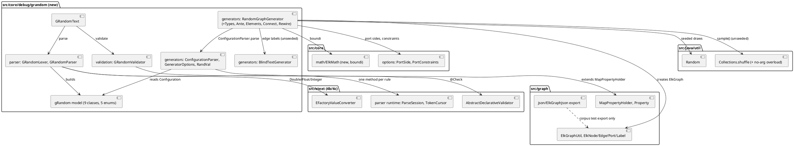

<!-- SPDX-License-Identifier: EPL-2.0 -->

# Component map — what mission 4f touches

```plantuml
@startuml
package "src/core/debug/grandom (new)" {
  [GRandomText] as facade
  [parser: GRandomLexer, GRandomParser] as parser
  [gRandom model (9 classes, 5 enums)] as model
  [validation: GRandomValidator] as validator
  [generators: ConfigurationParser,\nGeneratorOptions, RandVal] as options
  [generators: RandomGraphGenerator\n(+Types, Ante, Elements, Connect, Rewire)] as gen
  [generators: BlindTextGenerator] as blind
}
package "src/xtext (4b/4c)" {
  [parser runtime: ParseSession, TokenCursor] as rt
  [EFactoryValueConverter] as conv
  [AbstractDeclarativeValidator] as av
}
package "src/core" {
  [math/ElkMath (new, boundi)] as elkmath
  [options: PortSide, PortConstraints] as coreopts
}
package "src/graph" {
  [ElkGraphUtil, ElkNode/Edge/Port/Label] as graph
  [MapPropertyHolder, Property] as props
  [json/ElkGraphJson export] as json
}
package "src/java/util" {
  [Random] as random
  [Collections.shuffle (+ no-arg overload)] as shuffle
}
facade --> parser : parse
facade --> validator : validate
parser --> rt : one method per rule
parser --> conv : Double/Float/Integer
parser --> model : builds
validator --> av : @Check
options --> model : reads Configuration
options --> props : extends MapPropertyHolder
gen --> options : ConfigurationParser.parse
gen --> graph : creates ElkGraph
gen --> elkmath : boundi
gen --> random : seeded draws
gen --> shuffle : sample() (unseeded)
gen --> blind : edge labels (unseeded)
gen --> coreopts : port sides, constraints
json ..> graph : corpus test export only
@enduml
```
