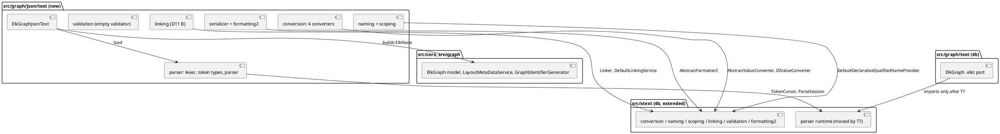

<!-- SPDX-License-Identifier: EPL-2.0 -->

# Component map — what mission 4c touches

```plantuml
@startuml
package "src/graph/json/text (new)" {
  [ElkGraphJsonText]
  [parser: lexer, token types, parser]
  [conversion: 4 converters]
  [naming + scoping]
  [linking (D11 B)]
  [validation (empty validator)]
  [serializer + formatting2]
}
package "src/xtext (4b, extended)" {
  [parser runtime (moved by T7)] as rt
  [conversion / naming / scoping / linking / validation / formatting2] as xt
}
package "src/graph/text (4b)" {
  [ElkGraph .elkt port] as elkt
}
package "src/core, src/graph" {
  [ElkGraph model, LayoutMetaDataService, GraphIdentifierGenerator] as model
}
[ElkGraphJsonText] --> [parser: lexer, token types, parser] : load
[parser: lexer, token types, parser] --> rt : TokenCursor, ParseSession
[conversion: 4 converters] --> xt : AbstractValueConverter, IDValueConverter
[naming + scoping] --> xt : DefaultDeclarativeQualifiedNameProvider
[linking (D11 B)] --> xt : Linker, DefaultLinkingService
[serializer + formatting2] --> xt : AbstractFormatter2
elkt --> rt : imports only after T7
[ElkGraphJsonText] --> model : builds ElkNode
@enduml
```
