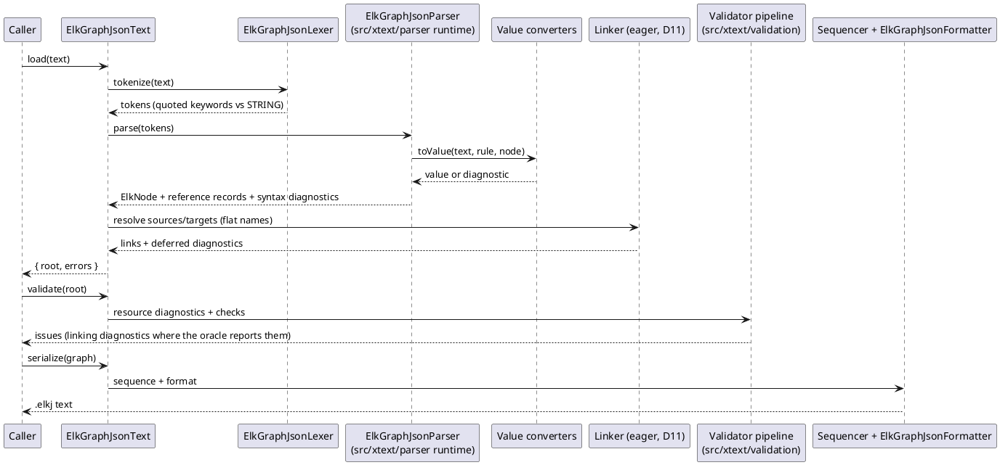
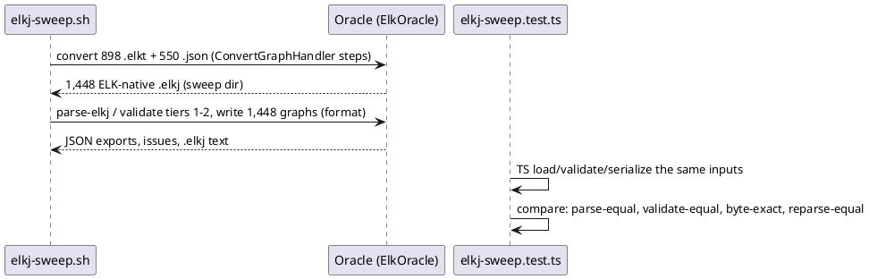

<!-- SPDX-License-Identifier: EPL-2.0 -->

# Data flow — `.elkj` load, validate, serialize

```plantuml
@startuml
participant "Caller" as c
participant ElkGraphJsonText as api
participant ElkGraphJsonLexer as lex
participant "ElkGraphJsonParser\n(src/xtext/parser runtime)" as parse
participant "Value converters" as conv
participant "Linker (eager, D11)" as link
participant "Validator pipeline\n(src/xtext/validation)" as val
participant "Sequencer + ElkGraphJsonFormatter" as ser
c -> api : load(text)
api -> lex : tokenize(text)
lex --> api : tokens (quoted keywords vs STRING)
api -> parse : parse(tokens)
parse -> conv : toValue(text, rule, node)
conv --> parse : value or diagnostic
parse --> api : ElkNode + reference records + syntax diagnostics
api -> link : resolve sources/targets (flat names)
link --> api : links + deferred diagnostics
api --> c : { root, errors }
c -> api : validate(root)
api -> val : resource diagnostics + checks
val --> c : issues (linking diagnostics where the oracle reports them)
c -> api : serialize(graph)
api -> ser : sequence + format
ser --> c : .elkj text
@enduml
```

```plantuml
@startuml
participant "elkj-sweep.sh" as sweep
participant "Oracle (ElkOracle)" as o
participant "elkj-sweep.test.ts" as t
sweep -> o : convert 898 .elkt + 550 .json (ConvertGraphHandler steps)
o --> sweep : 1,448 ELK-native .elkj (sweep dir)
sweep -> o : parse-elkj / validate tiers 1-2, write 1,448 graphs (format)
o --> sweep : JSON exports, issues, .elkj text
t -> t : TS load/validate/serialize the same inputs
t -> t : compare: parse-equal, validate-equal, byte-exact, reparse-equal
@enduml
```
