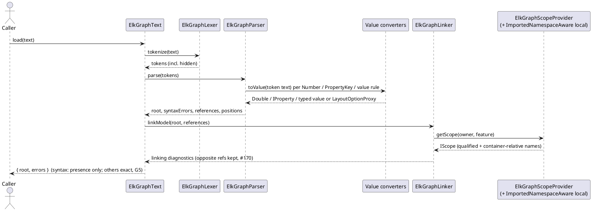
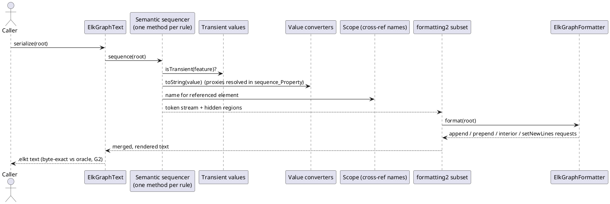
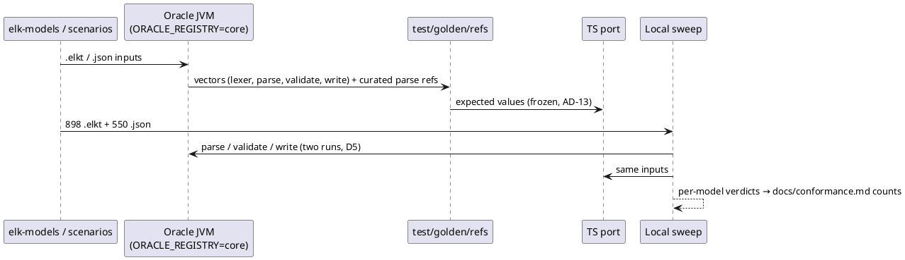

<!-- SPDX-License-Identifier: EPL-2.0 -->

# Data flow — graph-text

## Load (`ElkGraphText.load`, T18)

```plantuml
@startuml
actor Caller
participant ElkGraphText as E
participant ElkGraphLexer as L
participant ElkGraphParser as P
participant "Value converters" as C
participant ElkGraphLinker as K
participant "ElkGraphScopeProvider\n(+ ImportedNamespaceAware local)" as S

Caller -> E : load(text)
E -> L : tokenize(text)
L --> E : tokens (incl. hidden)
E -> P : parse(tokens)
P -> C : toValue(token text) per Number / PropertyKey / value rule
C --> P : Double / IProperty / typed value or LayoutOptionProxy
P --> E : root, syntaxErrors, references, positions
E -> K : linkModel(root, references)
K -> S : getScope(owner, feature)
S --> K : IScope (qualified + container-relative names)
K --> E : linking diagnostics (opposite refs kept, #170)
E --> Caller : { root, errors }  (syntax: presence only; others exact, G5)
@enduml
```

## Serialize (`ElkGraphText.serialize`, T19 + T21 + T22)

```plantuml
@startuml
actor Caller
participant ElkGraphText as E
participant "Semantic sequencer\n(one method per rule)" as Q
participant "Transient values" as T
participant "Value converters" as C
participant "Scope (cross-ref names)" as S
participant "formatting2 subset" as F
participant ElkGraphFormatter as G

Caller -> E : serialize(root)
E -> Q : sequence(root)
Q -> T : isTransient(feature)?
Q -> C : toString(value)  (proxies resolved in sequence_Property)
Q -> S : name for referenced element
Q --> F : token stream + hidden regions
F -> G : format(root)
G --> F : append / prepend / interior / setNewLines requests
F --> E : merged, rendered text
E --> Caller : .elkt text (byte-exact vs oracle, G2)
@enduml
```

## Evidence (batch 1 and T23)

```plantuml
@startuml
participant "elk-models / scenarios" as M
participant "Oracle JVM\n(ORACLE_REGISTRY=core)" as O
participant "test/golden/refs" as R
participant "TS port" as TS
participant "Local sweep" as W

M -> O : .elkt / .json inputs
O -> R : vectors (lexer, parse, validate, write) + curated parse refs
R -> TS : expected values (frozen, AD-13)
M -> W : 898 .elkt + 550 .json
W -> O : parse / validate / write (two runs, D5)
W -> TS : same inputs
W --> W : per-model verdicts → docs/conformance.md counts
@enduml
```
