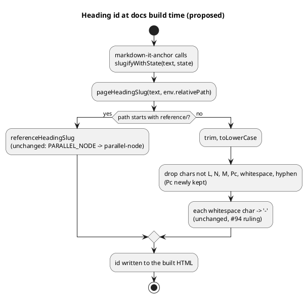

<!-- SPDX-License-Identifier: EPL-2.0 -->

# Data flow: heading-slug-underscore

How a heading gets its id at build time (proposed: Pc kept). Only `headingSlug`'s character class changes.

```plantuml
@startuml
title Heading id at docs build time (proposed)
start
:markdown-it-anchor calls\nslugifyWithState(text, state);
:pageHeadingSlug(text, env.relativePath);
if (path starts with reference/?) then (yes)
  :referenceHeadingSlug\n(unchanged: PARALLEL_NODE -> parallel-node);
else (no)
  :trim, toLowerCase;
  :drop chars not L, N, M, Pc, whitespace, hyphen\n(Pc newly kept);
  :each whitespace char -> '-'\n(unchanged, #94 ruling);
endif
:id written to the built HTML;
stop
@enduml
```
