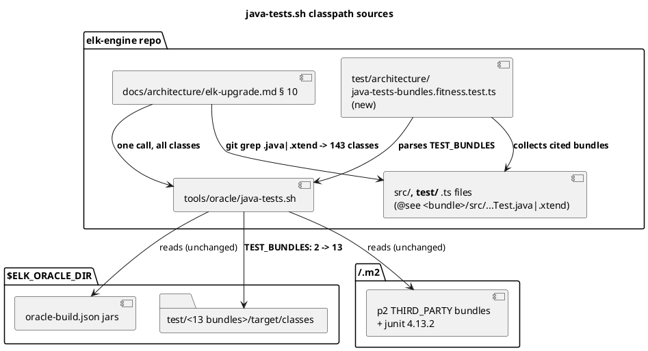

<!-- SPDX-License-Identifier: EPL-2.0 -->

# Component map: java-tests-bundles

What builds the JUnit classpath, and what the mission changes (bold labels).

```plantuml
@startuml
title java-tests.sh classpath sources
package "elk-engine repo" {
  [tools/oracle/java-tests.sh] as script
  [test/architecture/\njava-tests-bundles.fitness.test.ts\n(new)] as fit
  [src/**, test/** .ts files\n(@see <bundle>/src/...Test.java|.xtend)] as cites
  [docs/architecture/elk-upgrade.md § 10] as runbook
}
package "$ELK_ORACLE_DIR" {
  [oracle-build.json jars] as jars
  folder "test/<13 bundles>/target/classes" as classes
}
package "~/.m2" {
  [p2 THIRD_PARTY bundles\n+ junit 4.13.2] as m2
}
script --> jars : reads (unchanged)
script --> classes : **TEST_BUNDLES: 2 -> 13**
script --> m2 : reads (unchanged)
fit --> script : **parses TEST_BUNDLES**
fit --> cites : **collects cited bundles**
runbook --> cites : **git grep .java|.xtend -> 143 classes**
runbook --> script : **one call, all classes**
@enduml
```
