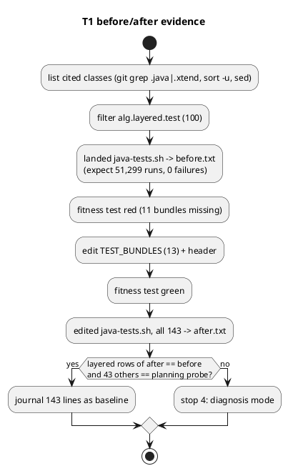

<!-- SPDX-License-Identifier: EPL-2.0 -->

# Data flow: java-tests-bundles evidence

How T1 proves the change on the pinned oracle.

```plantuml
@startuml
title T1 before/after evidence
start
:list cited classes (git grep .java|.xtend, sort -u, sed);
:filter alg.layered.test (100);
:landed java-tests.sh -> before.txt\n(expect 51,299 runs, 0 failures);
:fitness test red (11 bundles missing);
:edit TEST_BUNDLES (13) + header;
:fitness test green;
:edited java-tests.sh, all 143 -> after.txt;
if (layered rows of after == before\nand 43 others == planning probe?) then (yes)
  :journal 143 lines as baseline;
else (no)
  :stop 4: diagnosis mode;
endif
stop
@enduml
```
