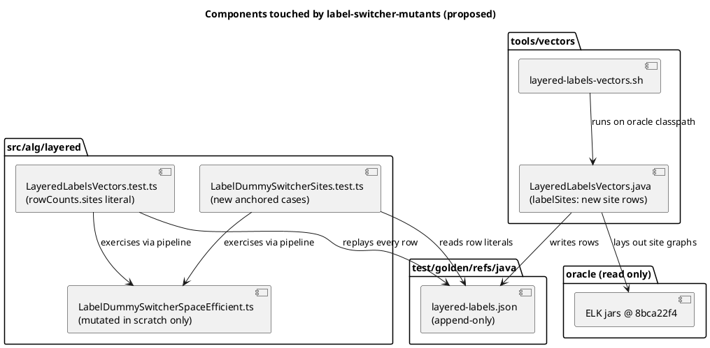

<!-- SPDX-License-Identifier: EPL-2.0 -->

# Component map: label-switcher-mutants

Which components the mission touches and how they relate (proposed).

```plantuml
@startuml
title Components touched by label-switcher-mutants (proposed)
package "oracle (read only)" {
  [ELK jars @ 8bca22f4] as Jars
}
package "tools/vectors" {
  [LayeredLabelsVectors.java\n(labelSites: new site rows)] as Rec
  [layered-labels-vectors.sh] as Sh
}
package "test/golden/refs/java" {
  [layered-labels.json\n(append-only)] as Ref
}
package "src/alg/layered" {
  [LayeredLabelsVectors.test.ts\n(rowCounts.sites literal)] as Replay
  [LabelDummySwitcherSites.test.ts\n(new anchored cases)] as Sites
  [LabelDummySwitcherSpaceEfficient.ts\n(mutated in scratch only)] as SE
}
Sh --> Rec : runs on oracle classpath
Rec --> Jars : lays out site graphs
Rec --> Ref : writes rows
Replay --> Ref : replays every row
Sites --> Ref : reads row literals
Replay --> SE : exercises via pipeline
Sites --> SE : exercises via pipeline
@enduml
```
