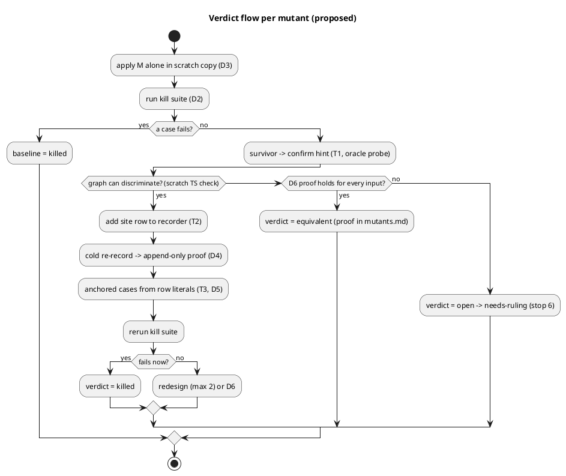

<!-- SPDX-License-Identifier: EPL-2.0 -->

# Data flow: label-switcher-mutants

How a mutant reaches its verdict (proposed).

```plantuml
@startuml
title Verdict flow per mutant (proposed)
start
:apply M alone in scratch copy (D3);
:run kill suite (D2);
if (a case fails?) then (yes)
  :baseline = killed;
else (no)
  :survivor -> confirm hint (T1, oracle probe);
  if (graph can discriminate? (scratch TS check)) then (yes)
    :add site row to recorder (T2);
    :cold re-record -> append-only proof (D4);
    :anchored cases from row literals (T3, D5);
    :rerun kill suite;
    if (fails now?) then (yes)
      :verdict = killed;
    else (no)
      :redesign (max 2) or D6;
    endif
  elseif (D6 proof holds for every input?) then (yes)
    :verdict = equivalent (proof in mutants.md);
  else (no)
    :verdict = open -> needs-ruling (stop 6);
  endif
endif
stop
@enduml
```
