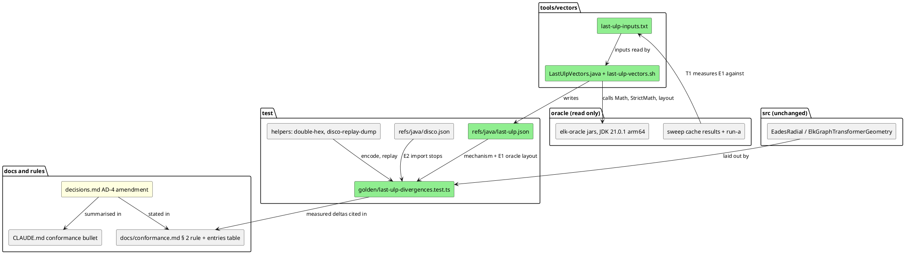

<!-- SPDX-License-Identifier: EPL-2.0 -->

# Component map: last-ulp-bar

Proposed state. Shaded components are new; the rest are read only.

```plantuml
@startuml
skinparam componentStyle rectangle
package "docs and rules" {
  [decisions.md AD-4 amendment] as AMD #LightYellow
  [CLAUDE.md conformance bullet] as CMD
  [docs/conformance.md § 2 rule + entries table] as CONF
}
package "tools/vectors" {
  [last-ulp-inputs.txt] as IN #LightGreen
  [LastUlpVectors.java + last-ulp-vectors.sh] as REC #LightGreen
}
package "oracle (read only)" {
  [elk-oracle jars, JDK 21.0.1 arm64] as ORA
  [sweep cache results + run-a] as SWP
}
package "test" {
  [refs/java/last-ulp.json] as REF #LightGreen
  [refs/java/disco.json] as DREF
  [golden/last-ulp-divergences.test.ts] as PIN #LightGreen
  [helpers: double-hex, disco-replay-dump] as HLP
}
package "src (unchanged)" {
  [EadesRadial / ElkGraphTransformerGeometry] as SRC
}
AMD --> CMD : summarised in
AMD --> CONF : stated in
IN --> REC : inputs read by
REC --> ORA : calls Math, StrictMath, layout
REC --> REF : writes
REF --> PIN : mechanism + E1 oracle layout
DREF --> PIN : E2 import stops
HLP --> PIN : encode, replay
SRC --> PIN : laid out by
SWP --> IN : T1 measures E1 against
PIN --> CONF : measured deltas cited in
@enduml
```
