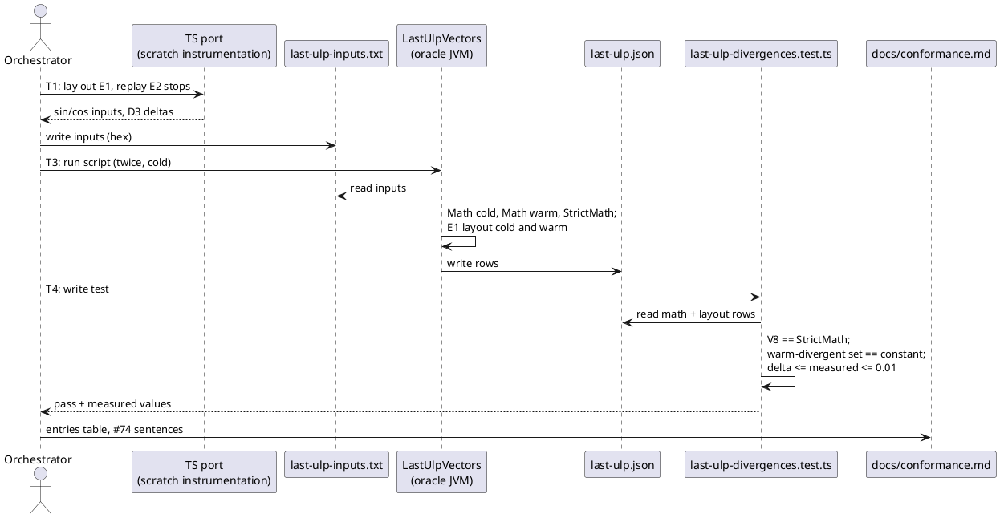

<!-- SPDX-License-Identifier: EPL-2.0 -->

# Data flow: last-ulp-bar

How an entry's evidence travels from collection to the pin.

```plantuml
@startuml
actor Orchestrator as O
participant "TS port\n(scratch instrumentation)" as TS
participant "last-ulp-inputs.txt" as IN
participant "LastUlpVectors\n(oracle JVM)" as REC
participant "last-ulp.json" as REF
participant "last-ulp-divergences.test.ts" as PIN
participant "docs/conformance.md" as DOC

O -> TS : T1: lay out E1, replay E2 stops
TS --> O : sin/cos inputs, D3 deltas
O -> IN : write inputs (hex)
O -> REC : T3: run script (twice, cold)
REC -> IN : read inputs
REC -> REC : Math cold, Math warm, StrictMath;\nE1 layout cold and warm
REC -> REF : write rows
O -> PIN : T4: write test
PIN -> REF : read math + layout rows
PIN -> PIN : V8 == StrictMath;\nwarm-divergent set == constant;\ndelta <= measured <= 0.01
PIN --> O : pass + measured values
O -> DOC : entries table, #74 sentences
@enduml
```
