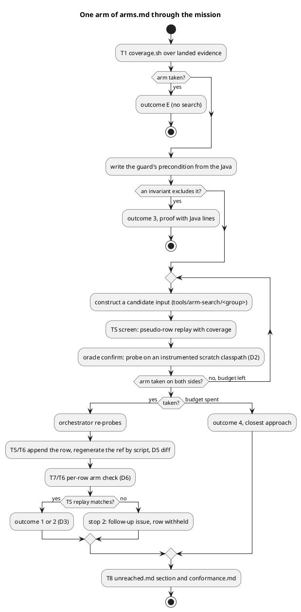

<!-- SPDX-License-Identifier: EPL-2.0 -->

# Data flow: from one arm to an outcome

```plantuml
@startuml
title One arm of arms.md through the mission
start
:T1 coverage.sh over landed evidence;
if (arm taken?) then (yes)
  :outcome E (no search);
  stop
endif
:write the guard's precondition from the Java;
if (an invariant excludes it?) then (yes)
  :outcome 3, proof with Java lines;
  stop
endif
repeat
  :construct a candidate input (tools/arm-search/<group>);
  :TS screen: pseudo-row replay with coverage;
  :oracle confirm: probe on an instrumented scratch classpath (D2);
repeat while (arm taken on both sides?) is (no, budget left)
if (taken?) then (yes)
  :orchestrator re-probes;
  :T5/T6 append the row, regenerate the ref by script, D5 diff;
  :T7/T6 per-row arm check (D6);
  if (TS replay matches?) then (yes)
    :outcome 1 or 2 (D3);
  else (no)
    :stop 2: follow-up issue, row withheld;
  endif
else (budget spent)
  :outcome 4, closest approach;
endif
:T8 unreached.md section and conformance.md;
stop
@enduml
```
