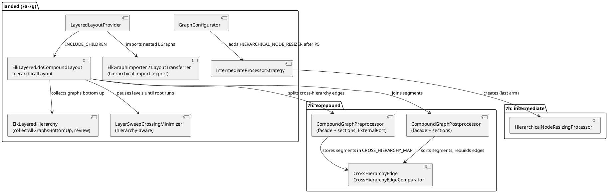

<!-- SPDX-License-Identifier: EPL-2.0 -->

# Component map — mission 7h

This shows the proposed state after the mission: the 7h classes (new or unstaged) and the landed pieces they plug into.

```plantuml
@startuml
package "landed (7a-7g)" {
  [LayeredLayoutProvider] as provider
  [ElkLayered.doCompoundLayout\nhierarchicalLayout] as driver
  [ElkLayeredHierarchy\n(collectAllGraphsBottomUp, review)] as hier
  [GraphConfigurator] as conf
  [IntermediateProcessorStrategy] as enum
  [LayerSweepCrossingMinimizer\n(hierarchy-aware)] as cm
  [ElkGraphImporter / LayoutTransferrer\n(hierarchical import, export)] as transform
}
package "7h: compound" {
  [CompoundGraphPreprocessor\n(facade + sections, ExternalPort)] as pre
  [CompoundGraphPostprocessor\n(facade + sections)] as post
  [CrossHierarchyEdge\nCrossHierarchyEdgeComparator] as che
}
package "7h: intermediate" {
  [HierarchicalNodeResizingProcessor] as hnrp
}
provider --> transform : imports nested LGraphs
provider --> driver : INCLUDE_CHILDREN
driver --> pre : splits cross-hierarchy edges
driver --> hier : collects graphs bottom up
driver --> cm : pauses levels until root runs
conf --> enum : adds HIERARCHICAL_NODE_RESIZER after P5
enum --> hnrp : creates (last arm)
pre --> che : stores segments in CROSS_HIERARCHY_MAP
post --> che : sorts segments, rebuilds edges
driver --> post : joins segments
@enduml
```
