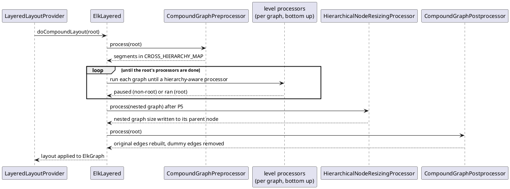
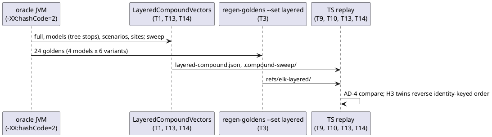

<!-- SPDX-License-Identifier: EPL-2.0 -->

# Data flow — mission 7h

## Hierarchical layout (`INCLUDE_CHILDREN`)

```plantuml
@startuml
participant "LayeredLayoutProvider" as P
participant "ElkLayered" as D
participant "CompoundGraphPreprocessor" as Pre
participant "level processors\n(per graph, bottom up)" as L
participant "HierarchicalNodeResizingProcessor" as R
participant "CompoundGraphPostprocessor" as Post
P -> D : doCompoundLayout(root)
D -> Pre : process(root)
Pre --> D : segments in CROSS_HIERARCHY_MAP
loop until the root's processors are done
  D -> L : run each graph until a hierarchy-aware processor
  L --> D : paused (non-root) or ran (root)
end
D -> R : process(nested graph) after P5
R --> D : nested graph size written to its parent node
D -> Post : process(root)
Post --> D : original edges rebuilt, dummy edges removed
D --> P : layout applied to ElkGraph
@enduml
```

## Evidence flow

```plantuml
@startuml
participant "oracle JVM\n(-XX:hashCode=2)" as O
participant "LayeredCompoundVectors\n(T1, T13, T14)" as Rec
participant "regen-goldens --set layered\n(T3)" as G
participant "TS replay\n(T9, T10, T13, T14)" as TS
O -> Rec : full, models (tree stops), scenarios, sites; sweep
O -> G : 24 goldens (4 models x 6 variants)
Rec -> TS : layered-compound.json, .compound-sweep/
G -> TS : refs/elk-layered/
TS -> TS : AD-4 compare; H3 twins reverse identity-keyed order
@enduml
```
