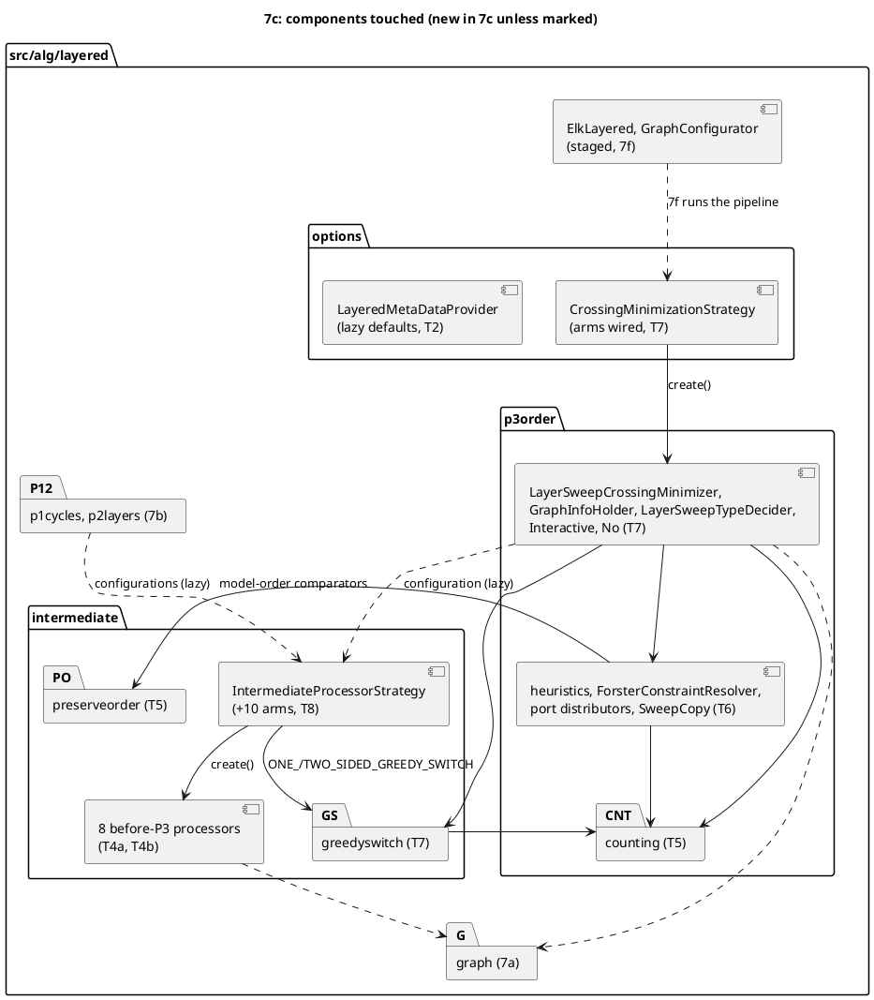
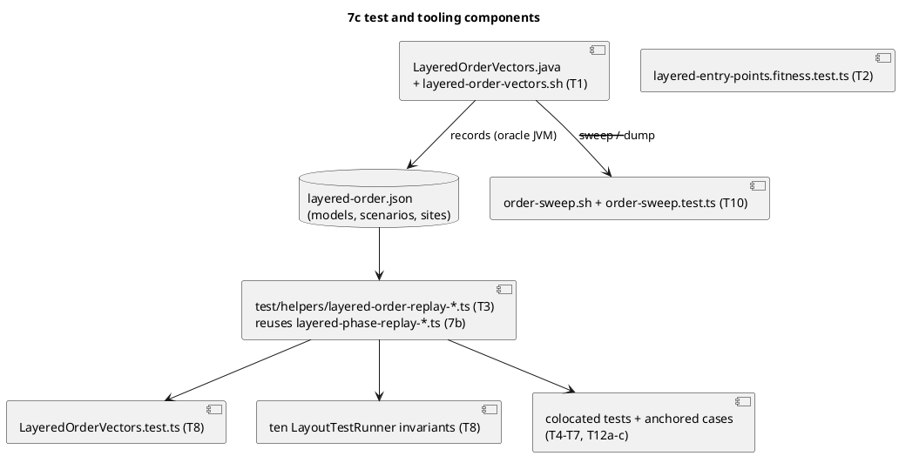

<!-- SPDX-License-Identifier: EPL-2.0 -->

# Component map — layered-crossing-min (mission 7c)

```plantuml
@startuml
title 7c: components touched (new in 7c unless marked)
package "src/alg/layered" {
  package "options" {
    component "CrossingMinimizationStrategy\n(arms wired, T7)" as CMS
    component "LayeredMetaDataProvider\n(lazy defaults, T2)" as MDP
  }
  package "graph (7a)" as G
  package "p1cycles, p2layers (7b)" as P12
  package "intermediate" {
    component "IntermediateProcessorStrategy\n(+10 arms, T8)" as IPS
    component "8 before-P3 processors\n(T4a, T4b)" as PRE
    package "greedyswitch (T7)" as GS
    package "preserveorder (T5)" as PO
  }
  package "p3order" {
    component "LayerSweepCrossingMinimizer,\nGraphInfoHolder, LayerSweepTypeDecider,\nInteractive, No (T7)" as LS
    component "heuristics, ForsterConstraintResolver,\nport distributors, SweepCopy (T6)" as HEU
    package "counting (T5)" as CNT
  }
  component "ElkLayered, GraphConfigurator\n(staged, 7f)" as EL
}
CMS --> LS : create()
IPS --> PRE : create()
IPS --> GS : ONE_/TWO_SIDED_GREEDY_SWITCH
LS --> HEU
LS --> GS
LS --> CNT
HEU --> CNT
GS --> CNT
HEU --> PO : model-order comparators
LS ..> G
PRE ..> G
P12 ..> IPS : configurations (lazy)
LS ..> IPS : configuration (lazy)
EL ..> CMS : 7f runs the pipeline
@enduml
```

```plantuml
@startuml
title 7c test and tooling components
component "LayeredOrderVectors.java\n+ layered-order-vectors.sh (T1)" as REC
database "layered-order.json\n(models, scenarios, sites)" as REF
component "test/helpers/layered-order-replay-*.ts (T3)\nreuses layered-phase-replay-*.ts (7b)" as HLP
component "LayeredOrderVectors.test.ts (T8)" as GEN
component "ten LayoutTestRunner invariants (T8)" as INV
component "colocated tests + anchored cases\n(T4-T7, T12a-c)" as UNIT
component "order-sweep.sh + order-sweep.test.ts (T10)" as SWP
component "layered-entry-points.fitness.test.ts (T2)" as FIT
REC --> REF : records (oracle JVM)
REF --> HLP
HLP --> GEN
HLP --> INV
HLP --> UNIT
REC --> SWP : --sweep / --dump
@enduml
```
