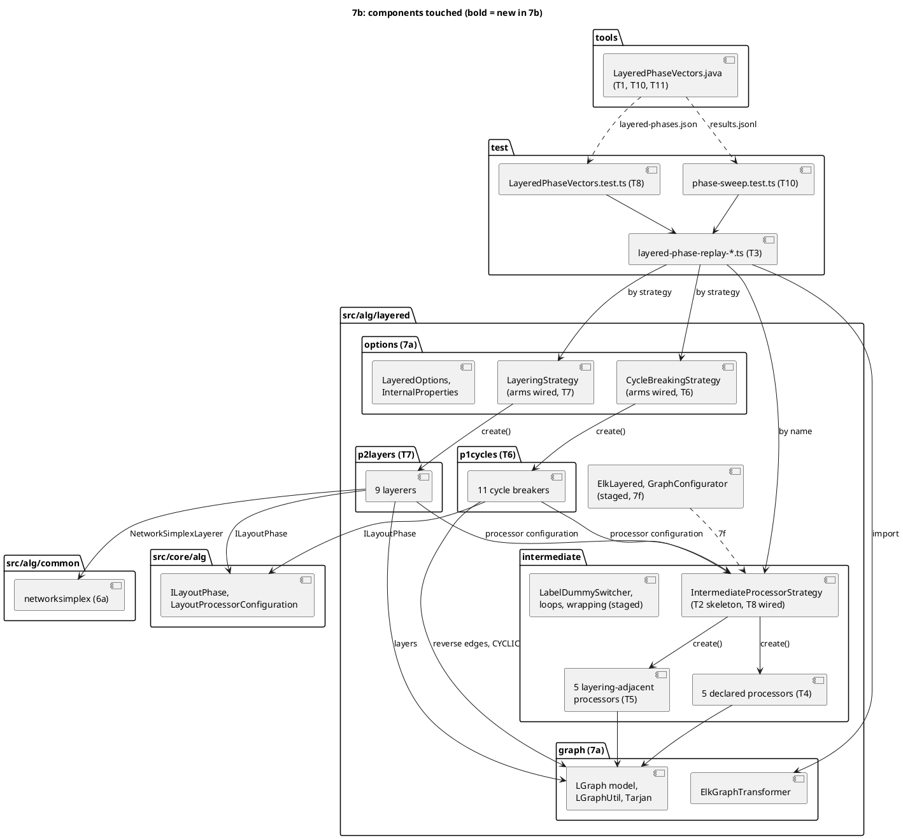

<!-- SPDX-License-Identifier: EPL-2.0 -->

# Component map — layered-cycles-layers (mission 7b)

```plantuml
@startuml
title 7b: components touched (bold = new in 7b)
package "src/alg/layered" {
  package "options (7a)" {
    component "CycleBreakingStrategy\n(arms wired, T6)" as CBS
    component "LayeringStrategy\n(arms wired, T7)" as LS
    component "LayeredOptions,\nInternalProperties" as OPT
  }
  package "graph (7a)" {
    component "LGraph model,\nLGraphUtil, Tarjan" as G
    component "ElkGraphTransformer" as X
  }
  package "p1cycles (T6)" as P1 {
    component "11 cycle breakers" as CB
  }
  package "p2layers (T7)" as P2 {
    component "9 layerers" as LY
  }
  package "intermediate" {
    component "IntermediateProcessorStrategy\n(T2 skeleton, T8 wired)" as IPS
    component "5 declared processors (T4)" as PA
    component "5 layering-adjacent\nprocessors (T5)" as PB
    component "LabelDummySwitcher,\nloops, wrapping (staged)" as ST
  }
  component "ElkLayered, GraphConfigurator\n(staged, 7f)" as EL
}
package "src/alg/common" {
  component "networksimplex (6a)" as NS
}
package "src/core/alg" {
  component "ILayoutPhase,\nLayoutProcessorConfiguration" as CA
}
package "test" {
  component "layered-phase-replay-*.ts (T3)" as H
  component "LayeredPhaseVectors.test.ts (T8)" as RT
  component "phase-sweep.test.ts (T10)" as SW
}
package "tools" {
  component "LayeredPhaseVectors.java\n(T1, T10, T11)" as REC
}
CBS --> CB : create()
LS --> LY : create()
CB --> IPS : processor configuration
LY --> IPS : processor configuration
CB --> G : reverse edges, CYCLIC
LY --> G : layers
LY --> NS : NetworkSimplexLayerer
IPS --> PA : create()
IPS --> PB : create()
CB --> CA : ILayoutPhase
LY --> CA : ILayoutPhase
PA --> G
PB --> G
H --> X : import
H --> IPS : by name
H --> CBS : by strategy
H --> LS : by strategy
RT --> H
SW --> H
REC ..> RT : layered-phases.json
REC ..> SW : results.jsonl
EL ..> IPS : 7f
@enduml
```
