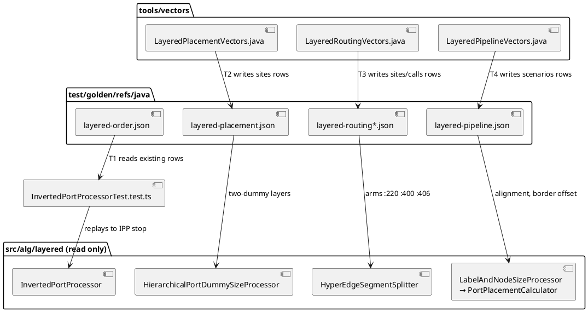

<!-- SPDX-License-Identifier: EPL-2.0 -->

# Component map: what each task touches

```plantuml
@startuml
package "tools/vectors" {
  [LayeredPlacementVectors.java] as pv
  [LayeredRoutingVectors.java] as rv
  [LayeredPipelineVectors.java] as plv
}
package "test/golden/refs/java" {
  [layered-order.json] as order
  [layered-placement.json] as place
  [layered-routing*.json] as route
  [layered-pipeline.json] as pipe
}
package "src/alg/layered (read only)" {
  [InvertedPortProcessor] as ipp
  [HierarchicalPortDummySizeProcessor] as hpds
  [HyperEdgeSegmentSplitter] as hes
  [LabelAndNodeSizeProcessor\n→ PortPlacementCalculator] as lns
}
[InvertedPortProcessorTest.test.ts] as t1
pv --> place : T2 writes sites rows
rv --> route : T3 writes sites/calls rows
plv --> pipe : T4 writes scenarios rows
order --> t1 : T1 reads existing rows
t1 --> ipp : replays to IPP stop
place --> hpds : two-dummy layers
route --> hes : arms :220 :400 :406
pipe --> lns : alignment, border offset
@enduml
```
