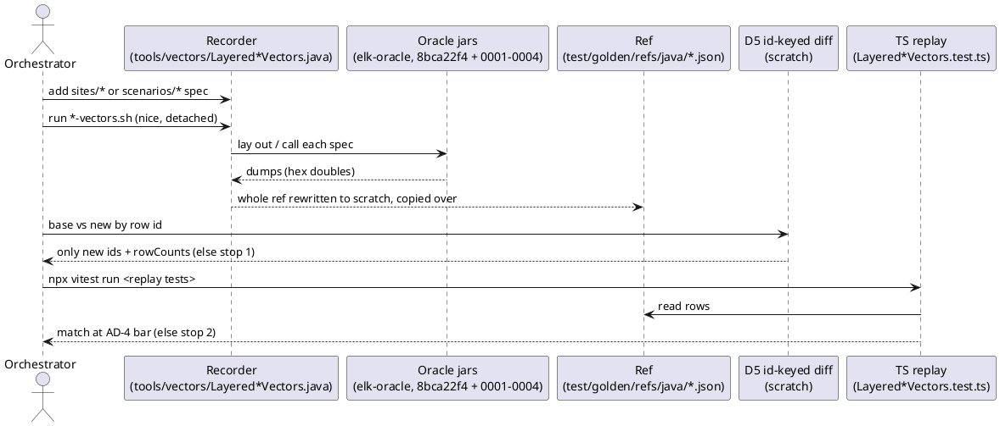

<!-- SPDX-License-Identifier: EPL-2.0 -->

# Data flow: a new evidence row

How each of T2-T4 turns a recorder edit into compared evidence (T1 reuses rows already recorded).

```plantuml
@startuml
actor Orchestrator as orch
participant "Recorder\n(tools/vectors/Layered*Vectors.java)" as rec
participant "Oracle jars\n(elk-oracle, 8bca22f4 + 0001-0004)" as oracle
participant "Ref\n(test/golden/refs/java/*.json)" as ref
participant "D5 id-keyed diff\n(scratch)" as diff
participant "TS replay\n(Layered*Vectors.test.ts)" as ts
orch -> rec : add sites/* or scenarios/* spec
orch -> rec : run *-vectors.sh (nice, detached)
rec -> oracle : lay out / call each spec
oracle --> rec : dumps (hex doubles)
rec --> ref : whole ref rewritten to scratch, copied over
orch -> diff : base vs new by row id
diff --> orch : only new ids + rowCounts (else stop 1)
orch -> ts : npx vitest run <replay tests>
ts -> ref : read rows
ts --> orch : match at AD-4 bar (else stop 2)
@enduml
```
