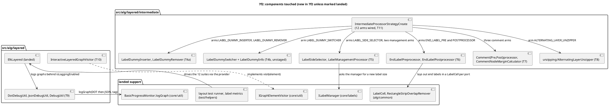

<!-- SPDX-License-Identifier: EPL-2.0 -->

# Component map — layered-labels (mission 7f2)

Components are grouped by the task that ports them; "landed" components are touched, not changed.

```plantuml
@startuml
title 7f2: components touched (new in 7f2 unless marked landed)
package "src/alg/layered/intermediate" {
  component "LabelDummyInserter, LabelDummyRemover (T4a)" as LD
  component "LabelDummySwitcher + LabelDummyInfo (T4b, unstaged)" as LS
  component "LabelSideSelector, LabelManagementProcessor (T5)" as LM
  component "EndLabelPreprocessor, EndLabelPostprocessor (T6)" as EL
  component "Comment{Pre,Post}processor,\nCommentNodeMarginCalculator (T7)" as CM
  component "unzipping/AlternatingLayerUnzipper (T8)" as UZ
  component "IntermediateProcessorStrategyCreate\n(12 arms wired, T11)" as IPC
}
package "src/alg/layered" {
  component "DotDebugUtil, JsonDebugUtil, DebugUtil (T9)" as DBG
  component "InteractiveLayeredGraphVisitor (T10)" as IV
  component "ElkLayered (landed)" as ELK
}
package "landed support" {
  component "LabelCell, RectangleStripOverlapRemover\n(alg/common)" as LC
  component "ILabelManager (core/labels)" as ILM
  component "IGraphElementVisitor (core/util)" as IGV
  component "BasicProgressMonitor.logGraph (core/util)" as BPM
  component "layout test runner, label metrics\n(test/helpers)" as RUN
}
IPC --> LD : arms LABEL_DUMMY_INSERTER, LABEL_DUMMY_REMOVER
IPC --> LS : arm LABEL_DUMMY_SWITCHER
IPC --> LM : arms LABEL_SIDE_SELECTOR, two management arms
IPC --> EL : arms END_LABEL_PRE and POSTPROCESSOR
IPC --> CM : three comment arms
IPC --> UZ : arm ALTERNATING_LAYER_UNZIPPER
EL --> LC : lays out end labels in a LabelCell per port
LM --> ILM : asks the manager for a new label size
IV ..> IGV : implements visit(element)
ELK --> DBG : logs graphs behind isLoggingEnabled
DBG --> BPM : logGraph(DOT then JSON, tag)
RUN --> ELK : drives the 12 suites via the provider
@enduml
```
