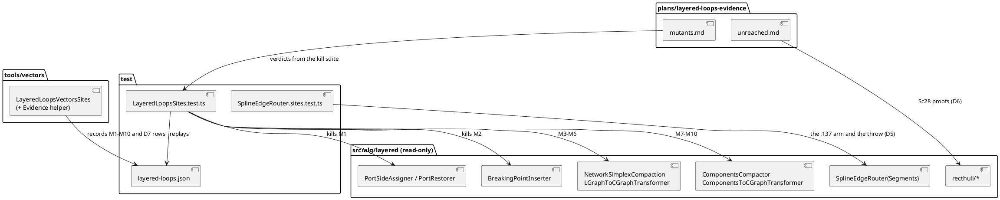

<!-- SPDX-License-Identifier: EPL-2.0 -->

# layered-loops-evidence: component map

The port classes under test (read-only) and the evidence artifacts this mission writes.

```plantuml
@startuml
skinparam monochrome true
package "src/alg/layered (read-only)" {
  [PortSideAssigner / PortRestorer] as loops
  [BreakingPointInserter] as bpi
  [NetworkSimplexCompaction\nLGraphToCGraphTransformer] as nsc
  [ComponentsCompactor\nComponentsToCGraphTransformer] as cc
  [SplineEdgeRouter(Segments)] as spl
  [recthull/*] as hull
}
package "tools/vectors" {
  [LayeredLoopsVectorsSites\n(+ Evidence helper)] as rec
}
package "test" {
  [layered-loops.json] as ref
  [LayeredLoopsSites.test.ts] as sites
  [SplineEdgeRouter.sites.test.ts] as stest
}
package "plans/layered-loops-evidence" {
  [mutants.md] as mut
  [unreached.md] as unr
}
rec --> ref : records M1-M10 and D7 rows
sites --> ref : replays
sites --> loops : kills M1
sites --> bpi : kills M2
sites --> nsc : M3-M6
sites --> cc : M7-M10
stest --> spl : the :137 arm and the throw (D5)
unr --> hull : Sc28 proofs (D6)
mut --> sites : verdicts from the kill suite
@enduml
```
