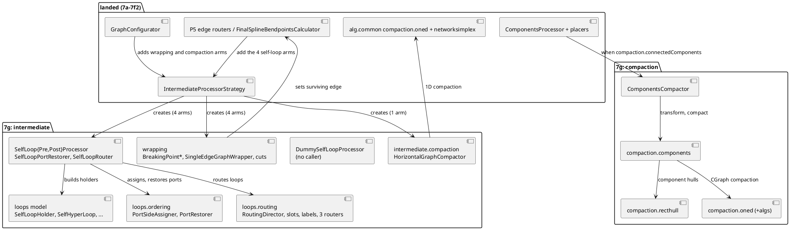

<!-- SPDX-License-Identifier: EPL-2.0 -->

# Component map — mission 7g

Proposed state after the mission: the 7g packages (new or unstaged) and the landed pieces they plug into.

```plantuml
@startuml
package "landed (7a-7f2)" {
  [IntermediateProcessorStrategy] as enum
  [GraphConfigurator] as conf
  [ComponentsProcessor + placers] as placers
  [P5 edge routers / FinalSplineBendpointsCalculator] as splines
  [alg.common compaction.oned + networksimplex] as common
}
package "7g: intermediate" {
  [SelfLoop{Pre,Post}Processor\nSelfLoopPortRestorer, SelfLoopRouter] as slproc
  [DummySelfLoopProcessor\n(no caller)] as dummy
  [loops model\nSelfLoopHolder, SelfHyperLoop, ...] as model
  [loops.ordering\nPortSideAssigner, PortRestorer] as ordering
  [loops.routing\nRoutingDirector, slots, labels, 3 routers] as routing
  [wrapping\nBreakingPoint*, SingleEdgeGraphWrapper, cuts] as wrapping
  [intermediate.compaction\nHorizontalGraphCompactor] as hcomp
}
package "7g: compaction" {
  [ComponentsCompactor] as ccomp
  [compaction.components] as ccomps
  [compaction.oned (+algs)] as oned
  [compaction.recthull] as hull
}
conf --> enum : adds wrapping and compaction arms
enum --> slproc : creates (4 arms)
enum --> wrapping : creates (4 arms)
enum --> hcomp : creates (1 arm)
slproc --> model : builds holders
slproc --> ordering : assigns, restores ports
slproc --> routing : routes loops
hcomp --> common : 1D compaction
splines --> enum : add the 4 self-loop arms
wrapping --> splines : sets surviving edge
placers --> ccomp : when compaction.connectedComponents
ccomp --> ccomps : transform, compact
ccomps --> oned : CGraph compaction
ccomps --> hull : component hulls
@enduml
```
